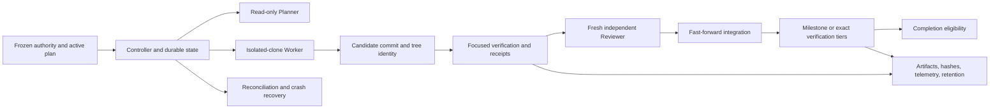

# Correctness and Efficiency Audit

Audit date: 2026-08-05  
Repository: `mclaurin10/milestone-loop-template`  
Audited branch: `p0-correctness-sweep` (tracking `origin/p0-correctness-sweep`)

Audited commit: `f4f2d7c630fe1054b956cf2f4b098ba5ab4e135a`

Audited tree: `fe9eff17fc021d0a315d042b26a9e8640bf49aa4`

Mode: evidence-backed audit and implementation planning only; no recommendations were implemented

## 1. Executive verdict

This post-remediation tree is materially safer than the earlier `master` audit. The P0 series now fences candidate identity through verification, review, and integration; protects the complete commissioned authority set; makes command-owned receipts mandatory; keeps telemetry non-semantic; requires approval before retention deletes anything; and strengthens reconciliation identity checks. Those are substantive controls, not documentation-only claims.

The repository is nevertheless **not ready to operate as a trusted autonomous controller or as a frictionless generic template**. Its current honest readiness result is failure/ineligible because adopting-project checks are placeholders or absent. That expected incompleteness must not obscure four confirmed P0 defects:

1. Candidate-authored verification and build commands run as ordinary controller child processes, outside the SDK Worker sandbox. They inherit access to the host filesystem, user profile, controller state, target repository, installed dependencies, process tree, and network. A permitted test or build edit can therefore cross the intended trust boundary before any review.
2. The `production-build` helper reports `PASS` and emits a valid-looking receipt while executing an empty command list. This is a direct false-evidence path prohibited by `AGENTS.md` and `CONTRACT.md`.
3. Stale-lease recovery can rename away a newly published live lease. A losing recovery participant can therefore remove the winner's lock and allow a third controller to enter.
4. The state store's advertised compare-and-swap is a read/compare/rename time-of-check/time-of-use sequence. In a 30-round concurrent probe, both same-revision writes succeeded in 16 rounds.

There are additional recovery defects: reconciliation does not reproduce all ordinary integration state mutations, and a crash after cloning a workspace but before persisting its path can strand an unadoptable deterministic workspace. Process cancellation, output bounding, durable state recovery, and path containment also need hardening.

The strongest safe efficiency opportunity is to redesign the test partitions as an executable disjoint union. The measured `test:unit:fast` command ran 310 of 321 tests yet took about 234 seconds, while the full `test:orchestrator` run took about 217 seconds. Candidate verification currently schedules both, paying for approximately 96.6% of the test surface twice. Removing that duplication only after proving partition coverage can save minutes without weakening the exact full closure.

The first implementation increment should be the smaller, unequivocal evidence defect: make `production-build` fail loud unless it executes a declared production build boundary and validates the resulting artifacts. It has low blast radius, admits strong adversarial tests, and restores the core rule that a `PASS` receipt proves work actually occurred. The subprocess trust boundary should follow immediately as the larger P0 program.

## 2. Scope and methodology

The audit followed the authority order in `AGENTS.md`: `PROJECT_GOAL.md`, the immutable acceptance contract and lock, `AGENTS.md`, `.agent/current-exec-plan.md`, then supporting architecture and operating records. The goal and acceptance files are explicit template placeholders, so product readiness cannot truthfully pass; they were treated as frozen for this session.

The following material was read and cross-checked against implementation:

- `README.md`, `PROJECT_GOAL.md`, `AGENTS.md`, `CONTRACT.md`, `.agent/PLANS.md`, `.agent/current-exec-plan.md`, both autonomy/decision logs, and `evals/immutable-contract-lock.json`.
- `.agent/completed/loop-recommissioning-verification.json`, all orchestrator configuration files and schemas, package/workspace configuration, the aggregate verifier, evidence helpers, and the workspace type-check wrapper.
- The orchestrator CLI, controller, lease, state store, Git isolation, path safety, verifier, reconciliation, verification tiers, artifact inventory, benchmark support, SDK gateway, prompt builders, schemas, and all corresponding tests.
- The complete worked example under `examples/ski-tycoon/` and recent extraction, recommissioning, genericization, and P0-remediation history.

The important paths were traced end to end: planner launch, Worker clone creation, candidate production, protected-path classification, focused verification, fresh independent review, integration, state persistence, restart reconciliation, exact readiness closure, command receipt production, artifact validation, and tier composition. Comments, README claims, and passing tests were treated as hypotheses until the executed code path supported them.

The audit also ran the repository baseline, focused verification tiers, migration and invariant suites, and two non-destructive targeted probes:

- A simultaneous same-revision `StateStore.save` probe in temporary directories, which removed all probe directories afterward.
- A runtime configuration probe showing that an unknown root key is accepted.

No exploit was run against the unsandboxed child-process boundary because proving the direct unrestricted `spawn` path did not justify risking host or repository mutation. Generated command evidence is retained only where this report references it. Timing is diagnostic, not a statistically rigorous benchmark: only conclusions large enough to survive the observed variance are treated as measured opportunities.

## 3. Repository and architecture map

The repository is an orchestration template rather than a finished product. Its controller coordinates agents and deterministic tools around an adopting repository. The principal control flow is:

Key ownership and boundaries:

| Component                                      | Responsibility                                            | Important trust boundary                                                        |
| ---------------------------------------------- | --------------------------------------------------------- | ------------------------------------------------------------------------------- |
| `tools/milestone-orchestrator/orchestrator.ts` | Main state machine, role sequencing, retries, integration | Must never treat agent claims or exit zero as sufficient evidence               |
| `controller-lease.ts`, `state-store.ts`        | Single-controller exclusion and durable, validated state  | Must serialize mutations across processes and survive interruption              |
| `git-isolation.ts`, `path-safety.ts`           | Standalone clone creation, identity, diff, cleanup        | Candidate writes must remain inside the exact isolated repository               |
| `codex-gateway.ts`, prompts, agent schemas     | SDK launch policy and structured role output              | Planner/Reviewer are read-only; Worker cannot weaken controller gates           |
| `verifier.ts`, `scripts/verify.mjs`            | Focused and exact verification interpretation             | `PASS`, `FAIL`, `NOT_READY`, `ERROR`, and eligibility must remain fail-closed   |
| `tools/evidence.mjs`, `run-tool-evidence.mjs`  | Command-owned receipts and artifact checks                | A receipt must prove an actual named production boundary ran                    |
| `verification-tier.ts`, manifests              | Iteration/candidate/milestone/periodic composition        | Reuse or partitioning must bind to exact candidate and contract identity        |
| `reconciliation.ts`                            | Recovery of externally advanced or interrupted work       | Must perform fresh verification/review and converge to ordinary state semantics |

The largest implementation modules are already maintenance signals: benchmark support is about 3,508 lines, the main orchestrator 2,931, schema/runtime validation 2,341, reconciliation 1,823, verifier 1,426, artifact inventory 1,235, verification-tier logic 1,023, and shared contracts 1,021. Size alone is not a defect, but it raises the cost of proving crash-boundary and state-transition equivalence.

## 4. Baseline commands and results

Initial repository state was clean on `p0-correctness-sweep`; the branch and commit matched `origin/p0-correctness-sweep`. There is no local or remote `main` branch in the inspected refs, even though the default template configuration names `main`. The available `master` branch was at `a7f5b3db5ab93a7247954a344bcb754a78230ce1`.

Environment:

- Node: `v25.9.0`; the repository pins exactly `24.18.0`, so this is an unsupported diagnostic environment.
- pnpm: `11.15.1`, matching the repository pin.
- Git: `2.54.0.windows.1`.
- Install state: `node_modules` present; `@openai/codex-sdk` resolved to `0.146.0`.
- Default verification profile: `readiness`; the permanent readiness marker exists.
- Default project configuration: target branch `main`; goal and acceptance checks remain adopting-project placeholders.

Commands were run from the audited tree:

| Command                                |              Exit | Approx. wall time | Interpretation and evidence                                                                                                                                                                      |
| -------------------------------------- | ----------------: | ----------------: | ------------------------------------------------------------------------------------------------------------------------------------------------------------------------------------------------ |
| `pnpm install --frozen-lockfile`       |                 0 |             1.2 s | Already up to date; emitted the expected Node engine mismatch warning                                                                                                                            |
| `pnpm typecheck`                       |                 0 |             5.6 s | `artifacts/manual/typecheck-18252/typecheck-report.json`                                                                                                                                         |
| `pnpm test:orchestrator`               | outer timeout 124 |           180.2 s | The invoking watchdog timed out. A child later wrote `artifacts/manual/test-orchestrator-15972/result.json`, but this invocation is not credited as a pass                                       |
| `pnpm test:orchestrator` (clean rerun) |                 0 |           217.2 s | 45 files, 107 suites, 321 tests passed; `artifacts/manual/test-orchestrator-20220/orchestrator-report.json`                                                                                      |
| `pnpm lint`                            |                 0 |            13.5 s | `artifacts/manual/lint-24660/lint-report.json`                                                                                                                                                   |
| `pnpm format:check`                    |                 0 |            11.5 s | `artifacts/manual/format-check-21572/format-report.json`                                                                                                                                         |
| `pnpm loop:doctor`                     |                 0 |             1.5 s | Reported `attention` for the runtime mismatch, but did not diagnose target-branch/tier-base/adoption blockers                                                                                    |
| `pnpm loop:demo-safety`                |                 0 |             1.7 s | Passed verification retry, interrupted reload, retry exhaustion, protected rejection, and manifest coverage demonstrations; evidence under `artifacts/orchestrator/runs/safety-demonstration/`   |
| `pnpm loop:verify:iteration`           |                 3 |             1.4 s | Base commit `1a441...` is not present/ancestral                                                                                                                                                  |
| `pnpm loop:verify:candidate`           |                 3 |             1.7 s | Same pre-check failure                                                                                                                                                                           |
| `pnpm loop:verify:milestone`           |                 3 |             2.0 s | Same pre-check failure                                                                                                                                                                           |
| `pnpm loop:verify:periodic`            |                 3 |             1.9 s | Same pre-check failure                                                                                                                                                                           |
| `pnpm verify`                          |                 1 |           236.5 s | Honest `FAIL`, completion ineligible; `artifacts/verify-2026-08-05T235346-041Z-7372/result.json`                                                                                                 |
| `pnpm test:unit:migrations`            |                 0 |             7.6 s | 11 tests passed; `artifacts/manual/test-unit-migrations-24880/result.json`                                                                                                                       |
| `pnpm test:invariants`                 |                 1 |            12.0 s | Its protected-integrity child invokes focused aggregate verification, which also runs the failing environment prerequisite; `artifacts/manual/test-invariants-22384/invariant-suite-report.json` |
| `pnpm test:unit:fast`                  |                 0 |           233.9 s | 310 tests passed; `artifacts/manual/test-unit-fast-2472/result.json` and partition report                                                                                                        |

Additional diagnostic commands/procedures materially relied upon:

| Command or procedure                                                                                                                                                                 | Exit/result       | Approx. wall time | Evidence or cleanup                                                                                                                                         |
| ------------------------------------------------------------------------------------------------------------------------------------------------------------------------------------ | ----------------- | ----------------: | ----------------------------------------------------------------------------------------------------------------------------------------------------------- |
| `node tools/run-tool-evidence.mjs invariant-vitest tools/milestone-orchestrator/src/schema.test.ts --fileParallelism=false --testNamePattern example-title`                          | 1                 |             5.8 s | Wrapper rejected the unsupported flag before testing; `artifacts/manual/invariant-vitest-24256/manifest.json`                                               |
| Inline Node ESM probe: 30 fresh temporary stores, each synchronizing two `StateStore.save(nextState, 0)` calls with `Promise.allSettled`, followed by recursive cleanup in `finally` | 16 both fulfilled |      not captured | No persistent artifact by design; all 30 temporary roots were removed. The aggregate counts and algorithm are recorded here to make the result reproducible |
| Inline Node ESM probe: `validateOrchestratorConfig({ ...validConfig(), targetBrnch: "typo" })`                                                                                       | valid, no errors  |      not captured | Read-only result printed to the terminal; no file generated                                                                                                 |
| `git merge-base --is-ancestor 1a441499fe565893460d75273b26ee9a71e133ff HEAD`                                                                                                         | 128               |            <0.1 s | Git reported the object invalid/not present, confirming that the tier failure is not merely a non-ancestor in otherwise available history                   |

The inline probe durations were not captured and are reported as such rather than reconstructed. Routine read-only inventory commands (`rg`, `git log`, schema/file reads, and JSON inspection) are not verification evidence and are not enumerated as baseline checks.

The exact aggregate result was semantically honest overall:

- `PASS`: typecheck, `production-build`, and contract-integrity.
- `FAIL`: environment because `verify:dependencies` is a deliberate placeholder; format-lint because `lint:architecture` is a deliberate placeholder.
- `NOT_READY`: ten product/readiness stages whose project-owned scripts are absent. The unit-domain stage first ran the real unit suite, then became `NOT_READY` on the absent domain script.
- Completion: `eligible: false`, because status was not `PASS`; start/final commit and tree identities remained clean and equal.

The `production-build` `PASS` is the exception to the otherwise honest semantics: its artifact records `commands: []`. That is a confirmed false-positive boundary, not expected template incompleteness.

The clean rerun's slow suites were approximately: orchestrator identity 54.6 s, reconciliation 25.0 s, verifier 22.9 s, cleanup 19.6 s, Git isolation 14.4 s, retention 13.7 s, invariant suite 12.5 s, and aggregate identity 7.0 s. These are single-run diagnostics suitable for prioritizing instrumentation, not precise benchmarks.

## 5. Preserved correctness invariants

Every recommendation below must preserve or strengthen these observed controls:

- Planner and Reviewer SDK turns are configured read-only; the Worker SDK turn uses a workspace-write sandbox in its isolated clone.
- The Worker changes a standalone repository clone, not the integration target directly.
- Candidate commit/tree/clean identity is captured after verification, required around review, embedded in structured review output, and checked again before fast-forward integration.
- Review uses a fresh read-only thread and evaluates the actual candidate diff.
- Protected paths include the frozen authority, acceptance contract/lock, package and lock files, readiness marker, verifier, configuration, and the entire orchestrator subtree. Renames and deletions are included; symlink and gitlink changes are rejected.
- Evidence is command-owned. Authoritative consumers validate path containment, real paths, kind, size, and SHA-256 rather than trusting a reported filename.
- Missing checks remain `NOT_READY` or fail; malformed or inconsistent output fails closed.
- Focused/non-default/dirty verification cannot support completion. Exact readiness closure requires a clean, unchanged identity and an eligible default-profile result.
- Telemetry is non-semantic: telemetry write failure is recorded but cannot change a correctness result.
- Artifact-retention deletion requires an explicit approved plan and is not an automatic startup side effect.
- Reconciliation performs new verification and a new independent review; it does not accept a stale textual success claim.
- Integration is fast-forward-only and occurs after plan, implementation, machine verification, and review gates.
- The bootstrap-to-readiness transition is intended to be permanent and history-audited.
- Affected-scope selection remains observational. It must not suppress required checks until its frozen safety criteria are proven.

Optimization work must not replace these controls with timestamp-based caches, path-only identity, process exit alone, agent attestation, mutable artifacts, or optimistic recovery.

## 6. Confirmed correctness defects

### CD-01 — Candidate-authored commands escape the Worker trust boundary

- **Type:** confirmed defect
- **Severity or priority:** P0 / critical
- **Confidence:** high; direct execution-path inspection
- **Affected files/components:** `tools/milestone-orchestrator/command-runner.ts`, `orchestrator.ts`, `verification-tier.ts`, `codex-gateway.ts`, `safeAgentEnvironment`, package scripts executed by verification
- **Observed evidence:** `codex-gateway.ts` applies the SDK `workspace-write` sandbox only to the Worker agent call. The controller's command runner uses ordinary Node `spawn` for repository-provided build/test commands, without an OS sandbox, filesystem allowlist, network denial, restricted token, container, or job object. Its sanitized environment still exposes location variables such as `CODEX_HOME`, `APPDATA`, `LOCALAPPDATA`, and `USERPROFILE`, plus executable search paths. Permitted source/test edits can run arbitrary top-level code during verification.
- **Failure mode or cost:** A Worker can intentionally or accidentally modify the target repository, controller state, evidence, installed dependencies, or files outside the clone; read controller/user material; contact the network; or leave descendant processes running. Review and protected-path checks happen too late to contain those effects. Candidate-owned tests therefore execute with more authority than the candidate-producing SDK turn.
- **Why existing tests or controls do or do not catch it:** Protected-path classification only constrains the committed diff. Environment secret filtering does not restrict filesystem discovery, child processes, or network. Receipt validation detects some artifact tampering after execution but is not containment. No adversarial integration test attempts writes to the target/state/home, network access, dependency mutation, or a surviving grandchild.
- **Recommended change:** Execute every candidate-authored build/test command through a controller-owned OS isolation supervisor. Give it a read-only exact source/toolchain input where feasible, or a disposable copy-on-write candidate layer, and allow writes only to declared build/output/artifact/temp paths. Deny integration/state/user-profile access and network by default; enforce disk/output/time quotas and process-tree termination. On Windows, use a restricted process/container strategy plus a Job Object; on Unix-like systems, use an equivalent namespace/container policy. Treat inability to establish the required sandbox as `NOT_READY` or failure, never as a fallback to unrestricted execution.
- **Safety properties that must remain unchanged:** exact candidate identity, command-owned receipts, independent artifact validation, real Git/filesystem boundary tests, fail-closed missing checks, and fresh exact closure.
- **Required tests or measurements:** adversarial commands for outside-write/read denial, target/state/evidence denial, network denial, symlink/junction escape, dependency mutation, output flood, forked/stubborn descendants, timeout, cancellation, and receipt production; run on supported Windows and Linux. Measure sandbox startup and I/O overhead.
- **Expected benefit:** closes the largest current authority inversion and makes subsequent caching or dependency reuse defensible.
- **Implementation complexity:** high; platform-specific and security-sensitive.
- **Dependencies or ordering constraints:** establish explicit threat model and supported OS primitives first. Do not remove the existing reinstall, diff, receipt, or identity defenses when adding containment.

### CD-02 — Empty production build produces `PASS` evidence

- **Type:** confirmed defect
- **Severity or priority:** P0 / high
- **Confidence:** high; reproduced in exact aggregate verification
- **Affected files/components:** `tools/run-tool-evidence.mjs`, `scripts/verify.mjs`, `package.json`, build receipt validation/tests
- **Observed evidence:** the build definition in `run-tool-evidence.mjs` has `commands: []`. The helper loops over that empty list, writes a `PASS` build report, and emits a passing receipt claiming completion through the production boundary. The aggregate artifact at `artifacts/verify-2026-08-05T235346-041Z-7372/stages/production-build/01-build/build-report.json` records status `PASS` and `commands: []`.
- **Failure mode or cost:** A readiness run can count `production-build` as successful without compiling, bundling, or producing any product artifact. This violates the explicit rule that no-op/placeholder scripts and assertion-only receipts cannot prove a stage.
- **Why existing tests or controls do or do not catch it:** Receipt checks validate structure, ownership, containment, hash, and size, but not the semantic requirement that at least one declared build command ran or that a product output was produced. No test rejects an empty build definition.
- **Recommended change:** Make the product build an adopter-owned, explicit adapter. If no real build command/output contract is configured, return `NOT_READY` (or the repository's documented placeholder failure), and do not issue a passing receipt. A passing build receipt should include the executed argv, exit result, exact candidate/toolchain/config identity, and validated output manifest/digests.
- **Safety properties that must remain unchanged:** command ownership, receipt/hash/size/realpath validation, exact-profile eligibility, and fail-loud placeholder behavior.
- **Required tests or measurements:** empty command list rejected; missing adapter is not ready; zero-exit command without required outputs rejected; real fixture build accepted; stale/malformed receipt rejected; aggregate completion remains ineligible when build is unconfigured.
- **Expected benefit:** removes a direct false-green evidence path with low implementation risk.
- **Implementation complexity:** low to medium.
- **Dependencies or ordering constraints:** implement first. Do not relabel a type check as the product build unless the contract explicitly defines that boundary.

### CD-03 — Stale-lease recovery can delete a fresh live lease

- **Type:** confirmed defect
- **Severity or priority:** P0 / critical
- **Confidence:** high; deterministic race follows directly from the recovery sequence
- **Affected files/components:** `tools/milestone-orchestrator/controller-lease.ts`, lease tests, all controller mutations
- **Observed evidence:** recovery reads a stale lease, later renames the shared lease path to quarantine, then compares the captured bytes with the originally observed bytes. If another process recovered and published a new lease between read and rename, the loser renames the new lease, notices the mismatch, and throws—but does not and cannot safely restore the unknown owner's lease.
- **Failure mode or cost:** The successful controller continues without its lease path. Its `release` tolerates `ENOENT`, while a third controller can acquire the now-empty path and concurrently mutate Git state, workspaces, artifacts, and controller state.
- **Why existing tests or controls do or do not catch it:** the race test proves only that exactly one of two initial contenders reports acquisition. It does not assert that the winner's lease remains present for its full lifetime, introduce a third contender, or force the vulnerable interleaving. State revision checks are not atomic and cannot compensate.
- **Recommended change:** replace rename-and-compare recovery with an OS-supported exclusive lock or an atomic lock-directory/handle protocol that never moves an unknown current owner. Tie every state mutation/integration boundary to a verifiable lease generation/token and fail if ownership is lost.
- **Safety properties that must remain unchanged:** stale-owner diagnosis, bounded recovery, actionable metadata, one-controller semantics, and safe release that never removes another owner's lock.
- **Required tests or measurements:** deterministic interleaving hooks, three-controller race, multiprocess stress, owner crash/restart, PID reuse, clock skew, malformed lease, and Windows/Unix lock semantics. Assert continuously that no non-owner can acquire while the winner is alive.
- **Expected benefit:** restores the serialization premise on which Git and state correctness depend.
- **Implementation complexity:** medium to high.
- **Dependencies or ordering constraints:** precedes reliance on state generation checks; choose a portable locking contract before implementation.

### CD-04 — State revision checking is not compare-and-swap

- **Type:** confirmed defect
- **Severity or priority:** P0 / high
- **Confidence:** high; code inspection plus reproducing probe
- **Affected files/components:** `tools/milestone-orchestrator/state-store.ts`, persistence contract, state tests
- **Observed evidence:** `save` loads the current revision, compares it to the caller's expected revision, then independently writes a temporary file and renames it over the state path. Two writers can both observe revision N and both publish N+1. In 30 simultaneous two-writer rounds against temporary stores, both writes fulfilled in 16 rounds; only one was rejected in 14.
- **Failure mode or cost:** A later rename silently loses one valid update while both callers believe they committed. Lost retry counters, milestone state, identities, or recovery decisions can cause duplicate execution or unsafe resumption.
- **Why existing tests or controls do or do not catch it:** the existing stale-writer test performs the first save and only then the second, reproducing the implementation's sequential assumption rather than the concurrent boundary. The lease is intended to serialize callers, but CD-03 makes that premise unreliable, and the public persistence claim calls this CAS.
- **Recommended change:** implement a true atomic transaction tied to robust lease ownership: for example, an exclusive state lock plus generation/token validation inside the same critical section, or a platform-independent transactional store. Stop describing the current sequence as CAS until it is atomic.
- **Safety properties that must remain unchanged:** schema validation before publish, temp-file durability, monotonic revision, fail-closed malformed state, and exact ownership diagnostics.
- **Required tests or measurements:** barrier-synchronized threads and separate processes writing the same revision; exactly one may commit. Add lost-lease-during-save, crash-at-each-write-step, and stale-generation recovery cases.
- **Expected benefit:** prevents silent state loss and makes retry/recovery reasoning compositional.
- **Implementation complexity:** medium; coupled to lease design.
- **Dependencies or ordering constraints:** design with CD-03; do not add a second incompatible lock layer casually.

### CD-05 — Reconciled integration does not reproduce ordinary integration state

- **Type:** confirmed defect
- **Severity or priority:** P0 / high
- **Confidence:** high; direct comparison of two integration paths
- **Affected files/components:** `orchestrator.ts` ordinary integration, `reconciliation.ts`/reconcile path, state schema and recovery tests
- **Observed evidence:** ordinary integration updates the verified commit, queue/active milestone fields, the required next vertical consumer, and `run.milestonesProcessed`. The recovery path that recognizes an already advanced target updates commit/queue/active/action but omits the vertical-consumer gate and processed-milestone increment.
- **Failure mode or cost:** The same externally visible integration produces different durable state depending on whether the controller crashed. A recovered exception milestone can lose its required immediate vertical consumer, and the run can process one more milestone than configured.
- **Why existing tests or controls do or do not catch it:** recovery tests assert completion, verified commit, and workspace cleanup, but not semantic equality with ordinary integration, the run counter, or consumer constraint.
- **Recommended change:** centralize the post-integration state transition in one pure, validated function used by ordinary and reconciliation paths. Persist enough pre-integration intent to make replay idempotent and distinguish already-applied transitions.
- **Safety properties that must remain unchanged:** fresh verification/review during reconciliation, exact candidate identity, fast-forward-only integration, and no duplicate milestone application.
- **Required tests or measurements:** table-driven equivalence tests over normal/exception milestones; crash before/after ref update and before/after state save; retry idempotency; max-milestone enforcement; consumer-gate preservation.
- **Expected benefit:** makes crash recovery converge to the same legal state as uninterrupted execution.
- **Implementation complexity:** medium.
- **Dependencies or ordering constraints:** coordinate with state transaction work; characterize current valid states before refactoring.

### CD-06 — Crash between clone creation and state persistence strands a workspace

- **Type:** confirmed defect
- **Severity or priority:** P0 / high
- **Confidence:** high; explicit unjournaled side-effect boundary
- **Affected files/components:** `orchestrator.ts` attempt startup, `git-isolation.ts`, restart/cleanup logic
- **Observed evidence:** attempt state is persisted, then the deterministic workspace directory is cloned, and only afterward is the workspace path persisted. A crash after clone success but before the second state save leaves a real directory absent from durable state. A resumed attempt tries to create the same deterministic path and encounters the existing clone.
- **Failure mode or cost:** Restart can loop through retries/escalation or require manual cleanup even though a usable exact clone exists. The orphan is invisible to state-driven cleanup and retention ownership.
- **Why existing tests or controls do or do not catch it:** there is no injected crash at this boundary and no restart test that adopts or quarantines an unrecorded deterministic workspace.
- **Recommended change:** persist workspace intent/path before creation and make clone creation idempotent. On resume, validate exact repository origin/base/clean identity before adopting; otherwise quarantine safely inside the workspace root.
- **Safety properties that must remain unchanged:** standalone clone isolation, deterministic ownership, strict containment, no adoption of an attacker-controlled or stale directory, and evidence-preserving cleanup.
- **Required tests or measurements:** crash before mkdir, after mkdir, during clone, after clone before save, and after save; valid adoption and invalid quarantine; junction/symlink substitution; Windows locked-file cleanup.
- **Expected benefit:** makes a common external side effect resumable and removes manual orphan recovery.
- **Implementation complexity:** medium.
- **Dependencies or ordering constraints:** combine with realpath-safe creation in CR-03, after lease/state ownership is reliable.

## 7. Correctness risks requiring further proof

### CR-01 — State replacement lacks recoverable directory-level durability

- **Type:** correctness risk
- **Severity or priority:** P1 / high
- **Confidence:** medium-high; durability gap is clear, exact failure behavior is filesystem/platform dependent
- **Affected files/components:** `state-store.ts`, state envelope/schema, startup recovery
- **Observed evidence:** state publication writes and fsyncs a temporary file and renames it, but does not fsync the parent directory and keeps no verified prior generation. A corrupt/truncated published state fails closed but has no automatic last-known-good recovery.
- **Failure mode or cost:** power loss or filesystem failure around rename can lose the directory entry or leave the only generation unreadable, halting recovery despite a previously valid state.
- **Why existing tests or controls do or do not catch it:** fault injection covers failure before rename, not power loss after rename, directory metadata durability, or recovery from a corrupted current generation.
- **Recommended change:** use a checksummed, versioned two-generation journal/backup protocol with directory sync where supported; choose the newest complete generation and preserve corrupt evidence for diagnosis.
- **Safety properties that must remain unchanged:** fail closed on ambiguity, runtime schema validation/migration, monotonic revision, atomic publication, and no silent reset to an empty state.
- **Required tests or measurements:** fault injection at every write/fsync/rename/directory-sync point, corrupted current with valid prior, both corrupt, Windows replacement semantics, and documented filesystem assumptions.
- **Expected benefit:** recoverability after host/filesystem interruption rather than merely process interruption.
- **Implementation complexity:** medium to high.
- **Dependencies or ordering constraints:** follow the lease/state transaction design so generation and ownership have one coherent protocol.

### CR-02 — Timeout and cancellation do not reliably terminate process trees or bound output

- **Type:** correctness risk
- **Severity or priority:** P1 / high
- **Confidence:** high for the implementation gap; platform-specific descendant behavior still needs an adversarial proof
- **Affected files/components:** command runner, aggregate verifier subprocess wrapper, CLI signal handling, telemetry/evidence finalization
- **Observed evidence:** the focused runner buffers stdout/stderr in unbounded arrays and sends `SIGTERM` only to the direct child on timeout. The aggregate verifier escalates to `SIGKILL` after five seconds but still targets the direct process and stores unbounded log chunks. The controller CLI has no coordinated `SIGINT`/`SIGTERM` shutdown path.
- **Failure mode or cost:** a descendant can survive timeout, retain pipes, keep the controller hung, or mutate files after failure evidence is written. Large output can exhaust memory. Abrupt cancellation leaves stale leases/workspaces and ambiguous command artifacts.
- **Why existing tests or controls do or do not catch it:** tests cover direct-child timeout and telemetry/artifact failures, not a stubborn grandchild, inherited pipe, output flood, or OS signal during each state transition.
- **Recommended change:** one cross-platform process supervisor with bounded streaming logs, truncation metadata/digests, group/job termination, escalation, shutdown grace, and final lease/state/evidence handling.
- **Safety properties that must remain unchanged:** complete enough logs for diagnosis, timeout as non-pass, command-owned receipts, no descendant artifact acceptance after termination, and no suppressed errors.
- **Required tests or measurements:** forked grandchild, ignored termination, inherited stdout, multi-gigabyte logical output with bounded storage, Ctrl-C at phase boundaries, Windows Job Object and Unix group behavior.
- **Expected benefit:** deterministic cancellation, bounded memory, and trustworthy post-timeout state.
- **Implementation complexity:** medium-high; can be part of CD-01's sandbox supervisor.
- **Dependencies or ordering constraints:** define artifact/log truncation semantics before implementation; do not silently discard diagnostic output.

### CR-03 — Workspace creation validates lexically but not against junction substitution

- **Type:** correctness risk
- **Severity or priority:** P1 / high
- **Confidence:** high on Windows junction behavior; exploitability depends on local write access/timing
- **Affected files/components:** `git-isolation.ts`, `path-safety.ts`, workspace-root configuration
- **Observed evidence:** clone creation checks that the computed path is lexically below `workspaceRoot`, creates its parent, and invokes Git. It does not lstat/realpath the existing root/ancestors at creation time. Cleanup code has stronger realpath-aware containment and junction tests, but creation does not reuse it.
- **Failure mode or cost:** a pre-existing or substituted junction can redirect the clone and later Worker writes outside the intended root. A validation-to-remove race also remains in cleanup, though its exposure is narrower.
- **Why existing tests or controls do or do not catch it:** junction tests exercise deletion safety, not workspace creation through an escaping root or ancestor swap.
- **Recommended change:** resolve and pin a controller-owned workspace root, reject reparse/symlink ancestors, open/create through safe handles where possible, and revalidate before handing the path to Git/SDK and before cleanup.
- **Safety properties that must remain unchanged:** standalone clone, strict descendant-only cleanup, no broad recursive removal, and Windows support.
- **Required tests or measurements:** root and intermediate junctions, symlink substitution, case aliases, long paths, locked files, and race-oriented platform tests.
- **Expected benefit:** makes the declared isolation boundary physical rather than lexical.
- **Implementation complexity:** medium-high and platform-specific.
- **Dependencies or ordering constraints:** align with CD-01's filesystem sandbox and CD-06's workspace-intent recovery.

### CR-04 — Dependency reinstall is not an immutable dependency boundary

- **Type:** correctness risk
- **Severity or priority:** P1 / high
- **Confidence:** high; already recorded in the decision log
- **Affected files/components:** verification dependency reinstall, ignored `node_modules`, package manager store/install state
- **Observed evidence:** verification runs frozen offline `pnpm install` with copy import mode. A byte edit inside an ignored installed package can survive when pnpm considers the install state current. Candidate Git identity and protected-path checks do not cover ignored dependencies.
- **Failure mode or cost:** candidate-authored execution could alter a verifier/test dependency, then obtain results from a toolchain not represented by commit/tree/lock identity.
- **Why existing tests or controls do or do not catch it:** reinstall, lock protection, and copy mode are useful defense in depth but do not hash or recreate every installed byte. There is no tamper-and-reverify adversarial test.
- **Recommended change:** perform verification in CD-01's fresh controller-owned environment with dependencies materialized from an immutable content-addressed store/snapshot and mounted read-only. Validate toolchain identity in receipts.
- **Safety properties that must remain unchanged:** frozen lockfile, offline/reproducible preference, no candidate writes to shared store, and exact evidence binding.
- **Required tests or measurements:** mutate installed dependency and package-manager metadata; prove the verifier either rejects or reconstructs it; measure fresh materialization overhead and cache correctness.
- **Expected benefit:** completes the candidate/toolchain identity boundary.
- **Implementation complexity:** medium once the sandbox exists, high as a standalone retrofit.
- **Dependencies or ordering constraints:** do not remove current reinstall until the stronger immutable environment is proven.

### CR-05 — Token budget is a post-turn accounting ceiling, not a hard limit

- **Type:** correctness risk
- **Severity or priority:** P1 / medium
- **Confidence:** high about semantics; SDK enforcement options require confirmation
- **Affected files/components:** agent invocation accounting, limit checks, configuration/README wording
- **Observed evidence:** the controller checks cumulative limits before a turn and adds actual token usage only after the turn completes. One turn can exceed the remaining configured budget by its entire response/context usage. Wall-clock timeouts and invocation counting have different enforcement points.
- **Failure mode or cost:** a configured “maximum” can be materially exceeded, increasing cost and making deterministic stop expectations false.
- **Why existing tests or controls do or do not catch it:** tests validate cumulative accounting and preflight rejection, not an oversized final turn or provider-side output cap.
- **Recommended change:** either enforce a per-turn remaining-budget cap through supported SDK/model limits plus a reserve, or rename/document the setting as a soft post-turn ceiling and expose overshoot telemetry. Never truncate structured output and then accept it.
- **Safety properties that must remain unchanged:** schema-validated complete agent output, retry accounting, no partial result treated as success, and non-semantic telemetry.
- **Required tests or measurements:** final-turn overshoot, retry overshoot, malformed/truncated output, provider usage absence, and SDK capability validation.
- **Expected benefit:** predictable cost controls and honest configuration semantics.
- **Implementation complexity:** low to medium depending on SDK support.
- **Dependencies or ordering constraints:** verify current SDK primitives before promising a hard cap.

### CR-06 — Legacy reconciliation records without candidate identity are not fenced

- **Type:** correctness risk
- **Severity or priority:** P1 / medium
- **Confidence:** medium-high
- **Affected files/components:** reconciliation migration/compatibility path, state schemas
- **Observed evidence:** reconciliation checks candidate identity when the stored candidate is non-null; a legacy passing verification record with a null candidate bypasses that comparison.
- **Failure mode or cost:** migrated old state could enter recovery without the same identity proof required by the post-remediation ordinary path.
- **Why existing tests or controls do or do not catch it:** migration tests preserve compatibility, but there is no adversarial legacy-PASS/null-identity recovery test demonstrating a fail-closed re-verification requirement.
- **Recommended change:** treat missing identity on any prior `PASS` as stale/untrusted and force fresh candidate capture, verification, and review before integration.
- **Safety properties that must remain unchanged:** supported schema migration, preservation of diagnostic history, and no implicit completion from legacy claims.
- **Required tests or measurements:** each supported legacy schema with null/malformed/mismatched identity, including already-advanced target cases.
- **Expected benefit:** makes the identity fence universal across upgrade paths.
- **Implementation complexity:** low.
- **Dependencies or ordering constraints:** can accompany CD-05's shared recovery transition.

## 8. Verification and test-suite gaps

The 321-test suite is substantial and unusually boundary-oriented. It creates real temporary Git repositories, exercises receipts and corruption, tests protected renames/deletes, rejects symlinks/gitlinks, covers reconciliation and retention, and verifies candidate identity drift. Passing it under an unsupported Node version is useful diagnostic evidence but not contractual evidence.

The most important undetected classes are listed below as a coverage map to the fully specified material findings elsewhere in this report; the rows are not additional independent findings.

| Related finding(s)  | Gap                                    | Why current tests can still pass                                            | Required addition                                                          |
| ------------------- | -------------------------------------- | --------------------------------------------------------------------------- | -------------------------------------------------------------------------- |
| CD-02               | Empty build semantics                  | Receipt tests validate shape/integrity, not proof that a build ran          | No-op/missing-output/real-output build fixtures                            |
| CD-01               | Candidate subprocess containment       | Tests run ordinary trusted commands                                         | Adversarial outside-write/read/network/dependency/process-tree matrix      |
| CD-03               | Lease ownership continuity             | Two contenders are checked only at acquisition result                       | Forced interleaving plus a third contender while winner remains live       |
| CD-04               | Real concurrent state CAS              | Stale-writer test is sequential                                             | Barrier-synchronized multiprocess same-revision writes                     |
| CD-06               | Clone-before-state crash               | No fault point exists between clone and persisted workspace path            | Stepwise crash/restart/adopt/quarantine tests                              |
| CD-05               | Recovery equivalence                   | Tests omit run counter and vertical-consumer assertions                     | Compare complete ordinary/recovered state for every milestone type         |
| CR-02               | Descendant/output/signal behavior      | Only direct timeout is covered                                              | Stubborn grandchildren, inherited pipes, output flood, SIGINT/CTRL_BREAK   |
| AH-01               | Tier default source coupling           | Unit fixtures inject a valid baseline                                       | End-to-end default-manifest test in a freshly generated adopter repo       |
| VS-01               | Default invariant executability        | Individual invariant behavior is tested, not the shipped aggregate command  | Clean-tree `pnpm test:invariants` must reach its intended checks           |
| AH-05               | Worked-example command drift           | Documentation is not executed                                               | Run every example command/flag in CI on supported platforms                |
| AH-05               | JSON/runtime schema parity             | State schema test checks parseability and ID, not equivalent rejection      | Generated or differential corpus tests across validators                   |
| CR-01, CR-02, CR-03 | Platform durability and path semantics | Temp tests cannot simulate power loss and cover only selected Windows cases | Windows/Linux matrix, long paths, directory sync, lock/process-tree probes |

Two concrete self-test failures deserve immediate visibility:

1. `pnpm test:invariants` cannot pass in the shipped template because its protected-integrity entry invokes `pnpm verify -- --stage contract-integrity`, while focused aggregate selection also runs the environment stage. The intentional `verify:dependencies` placeholder fails before the invariant suite can be green. This is not a product readiness failure; it is a harness-composition defect.
2. The Ski Tycoon example uses `--testNamePattern`, but the invariant Vitest wrapper rejects every extra flag except `--fileParallelism=false`. The documented command fails before running a test.

Test design should add deterministic fault-injection points around every externally visible transition rather than broad mocks. Critical tests should compare the complete durable state/evidence result of uninterrupted execution with every crash/re-entry variant. Coverage percentage would not detect the faulty shared assumptions in CD-03/CD-04/CD-05.

### VS-01 — The shipped invariant-suite command cannot reach a passing invariant result

- **Type:** maintainability issue
- **Severity or priority:** P2 / medium
- **Confidence:** high; reproduced with the documented package command
- **Affected files/components:** invariant-suite registry/runner, `scripts/verify.mjs` focused-stage selection, package scripts, invariant suite tests
- **Observed evidence:** `pnpm test:invariants` exits 1. Its protected-integrity entry invokes `pnpm verify -- --stage contract-integrity`, but focused aggregate selection unconditionally includes the environment stage as a prerequisite. The intentional `verify:dependencies` placeholder fails, even though the requested contract-integrity stage itself passes.
- **Failure mode or cost:** the template's own invariant aggregate cannot be used as an independent green harness while adopter environment checks are unconfigured. Maintainers cannot distinguish an invariant regression from unrelated placeholder readiness.
- **Why existing tests or controls do or do not catch it:** focused stage tests assert the current prerequisite selection and individual invariant logic; no clean shipped-template test requires the default `pnpm test:invariants` command to exercise and report its intended registry successfully.
- **Recommended change:** give the invariant entry a controller-owned direct contract-integrity verifier, or define an explicit exact-stage diagnostic mode that executes only the named stage and is permanently completion-ineligible. Keep ordinary focused aggregate prerequisite semantics unchanged unless the frozen contract authorizes otherwise.
- **Safety properties that must remain unchanged:** exact readiness still runs all required prerequisites, focused/diagnostic runs remain completion-ineligible, contract integrity remains controller-owned and fail-closed, and placeholders never pass.
- **Required tests or measurements:** clean shipped-template invariant run, actual contract mismatch, malformed receipt/artifact, environment placeholder present/absent, and proof that diagnostic stage results cannot support completion.
- **Expected benefit:** restores a reliable fast safety harness and removes misleading cross-stage coupling.
- **Implementation complexity:** low to medium.
- **Dependencies or ordering constraints:** independent of P0.1, but coordinate stage-selection terminology with `CONTRACT.md`; do not weaken exact aggregate selection.

## 9. Measured efficiency findings

### EF-01 — Candidate tiers duplicate almost the entire test surface

- **Type:** efficiency opportunity
- **Severity or priority:** P2 / high
- **Confidence:** high for duplication; medium for steady-state timing
- **Affected files/components:** `test:unit:fast`, `test:unit:migrations`, `test:orchestrator`, tier manifests, partition report
- **Observed evidence:** the fast partition executed 310 of the full suite's 321 tests (96.6%) and took about 233.9 s. The clean full run executed all 321 in about 217.2 s. Migration contributes the remaining 11 tests in about 7.6 s. Candidate composition schedules fast and full; milestone composition can add migration and exact unit/full closure.
- **Failure mode or cost:** candidate verification pays for almost every test twice, roughly 451 seconds using the observed component times, without creating meaningfully distinct coverage. The “fast” label is actively misleading on this tree.
- **Why existing tests or controls do or do not catch it:** partition validation proves membership for configured roots but does not enforce disjoint tier ownership or a latency objective. Exact closure is deliberately repeated, so duplication appears conservative.
- **Recommended change:** define one machine-generated test inventory and disjoint fast/migration/slow/integration partitions. Candidate tier should execute the appropriate disjoint union once; exact milestone/readiness closure must still run a fresh authoritative full suite when required. Bind any reuse to exact candidate, config, toolchain, environment, and command identity.
- **Safety properties that must remain unchanged:** no test removal, exact full closure freshness, focused runs remain ineligible for completion, invariant gates remain explicit, and partition omissions fail closed.
- **Required tests or measurements:** prove union equals actual Vitest discovery and intersections are empty; benchmark each partition at least five warm/cold runs on supported Node/OS; mutation-check representative omissions; compare tier wall time and artifacts before/after.
- **Expected benefit:** minutes saved per candidate cycle and clearer feedback ownership without reduced coverage.
- **Implementation complexity:** medium.
- **Dependencies or ordering constraints:** repair default tier/adoption coupling first enough to run an end-to-end tier; do not merely delete the exact closure.

### EF-02 — A few real-boundary suites dominate feedback latency

- **Type:** efficiency opportunity
- **Severity or priority:** P2 / medium
- **Confidence:** medium; one clean measurement plus a similar aggregate child run
- **Affected files/components:** identity, reconciliation, verifier, cleanup, Git isolation, retention, invariant tests
- **Observed evidence:** eight suites accounted for most visible latency, led by identity (~54.6 s), reconciliation (~25.0 s), verifier (~22.9 s), and cleanup (~19.6 s). These use valuable real Git/filesystem/subprocess boundaries.
- **Failure mode or cost:** repeated repository initialization, process startup, dependency verification, and serialized fixtures slow every local feedback cycle.
- **Why existing tests or controls do or do not catch it:** tests optimize correctness, not fixture reuse or per-boundary cost; current reports expose durations but do not attribute setup versus assertion time.
- **Recommended change:** instrument fixture setup/Git operations/process startup separately, then batch safe cases against immutable prebuilt bare fixtures or copy-on-write snapshots. Preserve per-test writable isolation and run mutation/race cases independently.
- **Safety properties that must remain unchanged:** real Git/filesystem/process coverage, independence of mutable state, supported Windows behavior, and deterministic ordering where required.
- **Required tests or measurements:** repeated per-suite profiles, fixture contamination sentinel, cold/warm disk comparison, and before/after variance/resource metrics.
- **Expected benefit:** faster focused feedback while retaining high-value integration coverage.
- **Implementation complexity:** medium.
- **Dependencies or ordering constraints:** instrumentation first; do not globally enable Vitest file parallelism without resource/determinism evidence.

### EF-03 — Format and lint are independent read-only work after setup

- **Type:** efficiency opportunity
- **Severity or priority:** P2 / low
- **Confidence:** medium
- **Affected files/components:** aggregate format-lint stage and command artifact allocation
- **Observed evidence:** standalone format check took ~11.5 s and lint ~13.5 s. Their source reads are independent, but the aggregate currently treats them serially together with the architecture placeholder.
- **Failure mode or cost:** approximately the shorter command's duration is avoidably on the critical path when resources permit.
- **Why existing tests or controls do or do not catch it:** correctness does not require serialization, but current command/evidence ownership was not designed around concurrent children.
- **Recommended change:** after the common process supervisor exists, run independent read-only checks concurrently with distinct command-owned artifact directories and deterministic aggregate ordering.
- **Safety properties that must remain unchanged:** separate receipts, isolated output, unambiguous command identity, bounded resources, and deterministic status aggregation.
- **Required tests or measurements:** receipt cross-talk/collision tests, one-child failure/timeout, constrained-host benchmarks, and stable summary ordering.
- **Expected benefit:** potentially several seconds per full verification; the upper bound is roughly the shorter child on an unconstrained host, but the actual gain must be benchmarked.
- **Implementation complexity:** low after supervisor support.
- **Dependencies or ordering constraints:** subordinate to CD-01/CR-02; concurrency before process ownership is not recommended.

## 10. Efficiency hypotheses requiring instrumentation

### EH-01 — Exact-identity receipt reuse may help repeated unchanged tiers

- **Type:** efficiency opportunity
- **Severity or priority:** P3 / medium
- **Confidence:** low-medium
- **Affected files/components:** verification tier planner, receipt index, artifact inventory, candidate/toolchain/environment identity
- **Observed evidence:** candidate, milestone, periodic, and exact commands can repeat unchanged controller-owned facts and test commands, but current data does not quantify how often identities are truly identical or how much validation costs.
- **Failure mode or cost:** naive caching can attribute stale evidence to a different tree, environment, contract, or command and weaken exact closure.
- **Why existing tests or controls do or do not catch it:** current controls correctly favor fresh execution; no cache exists to attack.
- **Recommended change:** first log potential reuse keys and hypothetical hit rates without changing scheduling. Consider reuse only for explicitly non-exact tiers and only with commit/tree/clean state, command argv/content, lock/toolchain, config/manifest, environment, and artifact hashes. Exact readiness closure remains fresh.
- **Safety properties that must remain unchanged:** command ownership, independent artifact validation, fresh exact closure, and focused/non-default ineligibility.
- **Required tests or measurements:** shadow hit-rate telemetry, validation-cost benchmark, malicious stale-artifact corpus, environment/config drift, cache corruption and eviction.
- **Expected benefit:** unknown; potentially useful for retries, possibly not worth complexity.
- **Implementation complexity:** high.
- **Dependencies or ordering constraints:** after sandbox/toolchain identity and partition redesign.

### EH-02 — Clone strategy may be optimized only after isolation benchmarks

- **Type:** deliberate tradeoff
- **Severity or priority:** P3 / low
- **Confidence:** low
- **Affected files/components:** Git workspace creation/cleanup
- **Observed evidence:** each attempt uses a standalone local clone, which has real startup/disk cost. No isolated clone timing or repository-size scaling data was captured separately.
- **Failure mode or cost:** switching to worktrees can expose shared Git metadata, refs, hooks, object replacement, or configuration and weaken the Worker boundary.
- **Why existing tests or controls do or do not catch it:** current tests validate standalone-clone behavior, not an alternative's complete isolation properties.
- **Recommended change:** instrument clone size/time/cleanup across realistic repositories. Evaluate read-only object alternates, reflink/copy-on-write clones, or hardened worktrees only with a written threat model and equivalent adversarial isolation suite.
- **Safety properties that must remain unchanged:** independent writable Git metadata, exact base/candidate identity, no target ref mutation by Worker, contained cleanup, and cross-platform support.
- **Required tests or measurements:** repository-size matrix, hooks/config/ref/object attacks, concurrent clones, disk usage, cleanup failure, Windows antivirus/lock effects.
- **Expected benefit:** unknown; likely repository-dependent.
- **Implementation complexity:** high.
- **Dependencies or ordering constraints:** after CD-01 and CR-03; retain standalone clones absent proof.

### EH-03 — Prompt/context serialization may waste tokens

- **Type:** efficiency opportunity
- **Severity or priority:** P3 / medium
- **Confidence:** medium that repetition exists, low on removable fraction
- **Affected files/components:** Planner/Worker/Reviewer prompts, replacement-worker retries, state-stored summaries/reviews/diffs
- **Observed evidence:** role prompts repeat authority descriptions; replacement workers receive prior summaries/reviews and full diffs; state serializes growing review/history material. No per-section prompt byte/token attribution is recorded.
- **Failure mode or cost:** repeated stable material increases latency/cost and can crowd out task-specific context. Over-aggressive reduction would create authority blindness or review the wrong diff.
- **Why existing tests or controls do or do not catch it:** token totals are accounted after turns, but prompt composition is not attributed by source or tested for minimum authority/context completeness.
- **Recommended change:** add non-semantic prompt manifests with section hashes, byte/token estimates, reuse frequency, and decision usefulness. Replace repeated derived prose with controller-generated compact structured manifests only where the agent still receives all governing authority and actual diff content needed for its role.
- **Safety properties that must remain unchanged:** explicit authority precedence, Planner understanding of the goal, Worker access to approved plan/reviewer feedback, Reviewer access to the actual complete candidate diff, and role independence.
- **Required tests or measurements:** per-role prompt attribution, retry growth, answer-quality/rejection-rate comparison on a fixed corpus, and omission adversarial cases.
- **Expected benefit:** potentially lower token cost and fewer context-limit retries; unquantified.
- **Implementation complexity:** medium.
- **Dependencies or ordering constraints:** instrument before changing prompts; do not lower model policy or reviewer scope by intuition.

### EH-04 — Repeated parsing, hashing, and retention scans are probably secondary

- **Type:** efficiency opportunity
- **Severity or priority:** P3 / low
- **Confidence:** low
- **Affected files/components:** config/manifest loading, artifact inventory, retention planning, package/test discovery
- **Observed evidence:** these operations recur, but observed command times are dominated by tests and subprocesses. No profile attributes material wall time to parsing or hashing.
- **Failure mode or cost:** optimizing them first adds cache invalidation complexity for negligible benefit.
- **Why existing tests or controls do or do not catch it:** functional tests do not profile cost; artifact validation intentionally repeats trust checks.
- **Recommended change:** add phase timers and file/byte counts. Cache only immutable parsed data within one controller process; never skip artifact hashing or cross-process validation on the basis of timestamps.
- **Safety properties that must remain unchanged:** hash-based evidence integrity, path containment, schema validation at trust boundaries, and non-destructive retention.
- **Required tests or measurements:** profiles on small/large artifact inventories, cache invalidation corpus, validation-cost-to-work-cost comparison.
- **Expected benefit:** likely small; information may confirm no action.
- **Implementation complexity:** low instrumentation, potentially high caching.
- **Dependencies or ordering constraints:** defer until EF-01 and slow-suite work.

## 11. Adoption and maintainability findings

### AH-01 — Shipped verification tiers are coupled to an absent source-project baseline

- **Type:** adoption hazard
- **Severity or priority:** P1 / high
- **Confidence:** high; all four tier commands reproduced the failure
- **Affected files/components:** `.agent/completed/loop-recommissioning-verification.json`, verification-tier schema/validator, reconciliation reviewer, default configuration, doctor
- **Observed evidence:** every tier exits 3 because baseline commit `1a441...` does not exist in the inspected history. The schema hardcodes milestone `d032-loop-efficiency-recommissioning`, a `d031BaselineCommit`, and D-031 review checks. Reconciliation validation requires a specific intermediate result shape (five `PASS`, ten `NOT_READY`) rather than accepting a generic adopting repository lifecycle.
- **Failure mode or cost:** a fresh adopter cannot run the advertised tier commands or reconciliation without hidden source-project history, despite the template appearing configured.
- **Why existing tests or controls do or do not catch it:** tests inject synthetic valid commits/manifests; `loop:doctor` does not check target branch existence, baseline object/ancestry, or generic lifecycle compatibility.
- **Recommended change:** separate historical recommissioning evidence from the distributable default. Generate an adopter-owned baseline/manifest during initialization, validate commit existence/ancestry and check IDs, and make reconciliation rules derive from versioned generic contract data rather than D-031/D-032 constants.
- **Safety properties that must remain unchanged:** historical evidence immutability, exact baseline identity, fresh reconciliation verification/review, and fail-closed missing provenance.
- **Required tests or measurements:** GitHub-template/fresh-clone initialization, unrelated history, missing/moved target branch, valid/invalid ancestry, generic readiness progression, and retained historical fixture tests.
- **Expected benefit:** removes a hard adoption blocker and source-project coupling.
- **Implementation complexity:** medium-high.
- **Dependencies or ordering constraints:** define distributable versus historical artifacts explicitly; do not rewrite existing baseline evidence.

### AH-02 — Default branch and readiness-transition lifecycle require hidden manual intervention

- **Type:** adoption hazard
- **Severity or priority:** P1 / high
- **Confidence:** high
- **Affected files/components:** default config, package profile, readiness marker, protected paths, README, initialization flow, doctor
- **Observed evidence:** configuration targets `main`, but the repository exposes `master` and the audit branch. The repository is already marked `readiness`; a typical “Use this template” history can inherit the permanent marker before an adopter gets a clean bootstrap. Both `package.json` and the marker are protected from Worker edits, while the documented bootstrap-to-readiness transition requires changing them. The only reconciliation mechanism is source-project-specific.
- **Failure mode or cost:** an adopter can be permanently `NOT_READY`, accidentally violate one-way history rules, or need an undocumented external/manual protected-file commit. Conversely, casual marker deletion could appear to obtain a bootstrap green result and undermine rollback protection.
- **Why existing tests or controls do or do not catch it:** history tests enforce rollback once configured but do not exercise actual template-host creation. Doctor reports only `attention` for the runtime and considers the config valid despite nonexistent target/tier base.
- **Recommended change:** ship a bootstrap-neutral distributable or controller-owned initializer that selects/validates the actual target branch, creates adopter authority placeholders and baseline, and records a one-way transition through an explicit controller-owned command after a clean eligible bootstrap receipt. The command, not a Worker, performs the protected update and writes auditable history.
- **Safety properties that must remain unchanged:** one-way readiness, no Worker authority edits, immutable baseline hashes, clean eligible bootstrap prerequisite, and no transition rollback for a green result.
- **Required tests or measurements:** GitHub template history, archive download without `.git`, `main`/`master`/custom branches, aborted/retried transition, malicious rollback, dirty tree, missing receipt, and source template upgrade.
- **Expected benefit:** makes the lifecycle discoverable and safely executable without source-project knowledge.
- **Implementation complexity:** medium-high.
- **Dependencies or ordering constraints:** coordinate with AH-01; requires an explicit frozen-contract-compatible transition design.

### AH-03 — Doctor is advisory where it should expose lifecycle blockers

- **Type:** adoption hazard
- **Severity or priority:** P2 / medium
- **Confidence:** high
- **Affected files/components:** `loop:doctor`, diagnostics, README/setup flow
- **Observed evidence:** doctor returned exit 0 with `attention` for the unsupported Node runtime and did not report nonexistent `main`, invalid tier baseline ancestry, placeholder authority/checks, unexecutable invariant command, or the already-activated readiness profile. It treats missing state as acceptable and authentication as available based on local material rather than a real SDK capability check.
- **Failure mode or cost:** adopters receive a reassuring executable result while core lifecycle commands cannot start, producing late and confusing failures.
- **Why existing tests or controls do or do not catch it:** doctor tests validate its current limited checklist, not end-to-end readiness for the next documented action.
- **Recommended change:** add a phase-aware diagnostic graph and `--strict` mode. Report supported runtime, target ref, baseline ancestry, authority placeholder state, default profile/marker consistency, configured stage adapters, tier manifest consistency, writable/real workspace root, state/lease health, and an optional non-mutating SDK probe.
- **Safety properties that must remain unchanged:** diagnostics are observational, do not mutate authority/state, do not expose credentials, and never convert a blocker into pass.
- **Required tests or measurements:** fresh adopter fixtures for each lifecycle phase, multiple simultaneous failures with actionable ordering, offline/auth-unavailable behavior, and exit-code contract tests.
- **Expected benefit:** shifts failures to setup time and reduces manual diagnosis.
- **Implementation complexity:** medium.
- **Dependencies or ordering constraints:** follow AH-01/AH-02 lifecycle definition so diagnostics have one authoritative model.

### AH-04 — Runtime config accepts unknown root keys

- **Type:** maintainability issue
- **Severity or priority:** P2 / medium
- **Confidence:** high; direct probe
- **Affected files/components:** configuration runtime validator, JSON schema/parity tests
- **Observed evidence:** adding `targetBrnch: "typo"` to an otherwise valid config returned `valid: true` with no errors. Nested objects use strict key checks, but the root validator does not.
- **Failure mode or cost:** misspelled root settings are silently ignored and defaults continue, potentially targeting the wrong branch or weakening the intended configuration without an error.
- **Why existing tests or controls do or do not catch it:** invalid nested keys are covered; unknown root keys are not included in the corpus.
- **Recommended change:** reject unknown root keys with precise JSON paths and add explicit schema-versioned migration/extension handling.
- **Safety properties that must remain unchanged:** versioned migrations, actionable validation errors, no silent defaulting of security-sensitive values, and backward compatibility only where explicitly declared.
- **Required tests or measurements:** typo/property-based unknown keys at every level, supported legacy versions, duplicated/ambiguous aliases, and JSON/runtime validator differential tests.
- **Expected benefit:** prevents silent misconfiguration and support churn.
- **Implementation complexity:** low.
- **Dependencies or ordering constraints:** can ship independently; document any previously accepted extension keys before tightening.

### AH-05 — Schemas and worked example have observable drift

- **Type:** maintainability issue
- **Severity or priority:** P2 / medium
- **Confidence:** high
- **Affected files/components:** state JSON schema, runtime validator, TypeScript contracts, schema registry tests, Ski Tycoon example/config docs, invariant wrapper
- **Observed evidence:** the state JSON schema leaves major repository/run/hidden/milestone items as shallow generic objects while the runtime validator is detailed. Schema tests mainly parse and check identifiers rather than rejection parity. The example/docs mention schema `1.3` while default config is `1.4.0`, and the documented `--testNamePattern` command is rejected by the wrapper.
- **Failure mode or cost:** external tooling accepts state the controller rejects; maintainers update one of three contract representations; adopters copy commands that cannot run.
- **Why existing tests or controls do or do not catch it:** schemas are tested as artifacts rather than as semantic peers; example commands are not executed in CI.
- **Recommended change:** choose one canonical contract source and generate runtime/JSON/TypeScript representations where practical, with differential corpus tests. Execute all worked-example commands and version references in CI.
- **Safety properties that must remain unchanged:** runtime validation remains authoritative and fail-closed; migrations are explicit; examples cannot weaken flags or skip invariant coverage.
- **Required tests or measurements:** valid/invalid shared corpus, unknown/deep malformed state, generated-file drift check, and end-to-end example command tests.
- **Expected benefit:** reduces contract drift and makes adoption instructions trustworthy.
- **Implementation complexity:** medium-high for generation, low for immediate example fixes.
- **Dependencies or ordering constraints:** characterize all existing accepted states before consolidating validators.

### AH-06 — Large phase-spanning modules make recovery equivalence hard to prove

- **Type:** maintainability issue
- **Severity or priority:** P3 / medium
- **Confidence:** medium-high
- **Affected files/components:** orchestrator, reconciliation, schema, verifier, benchmark, artifact inventory, verification tier, contracts
- **Observed evidence:** several modules exceed 1,000–3,500 lines, and equivalent state transitions are duplicated across ordinary/recovery paths, as CD-05 demonstrates.
- **Failure mode or cost:** reviews miss semantic differences across distant branches; crash-point testing requires broad setup; changes have large regression blast radius.
- **Why existing tests or controls do or do not catch it:** the suite is broad, but phase behavior is not expressed as small pure transition functions with shared equivalence tests.
- **Recommended change:** after characterization, extract pure state transitions, command/evidence adapters, and phase-specific services behind unchanged schemas. Refactor one boundary at a time without mixing optimization or behavior change.
- **Safety properties that must remain unchanged:** serialized state shape/migrations, exact gate order, retry semantics, identity fencing, and receipt contracts.
- **Required tests or measurements:** golden state-transition corpus, ordinary/recovery equivalence, module dependency checks, full supported verification after each extraction.
- **Expected benefit:** smaller review units and safer future recovery work.
- **Implementation complexity:** high.
- **Dependencies or ordering constraints:** after P0 behavior fixes; never use refactoring to obscure a semantic change.

## 12. Deliberate tradeoffs and “do not optimize” controls

The following apparent costs are justified until contrary evidence is produced:

- **Fresh independent review:** keep a separate read-only Reviewer turn. Combining Worker and Reviewer reduces independence and lets the author grade its own candidate.
- **Fresh exact closure:** do not satisfy completion from focused, non-default, dirty, cached, or earlier candidate results. Exact readiness verification must execute against the final clean identity.
- **Standalone clones:** keep them until an alternative proves equivalent Git metadata/ref/hook/object isolation on Windows and Unix-like systems.
- **Command-owned receipts plus independent hashing:** do not replace them with exit zero, timestamps, agent claims, or a shared mutable summary.
- **Full protected authority set:** do not narrow it to improve Worker convenience. Protected config/verifier/lock/marker changes require a controller-owned or human-authorized lifecycle.
- **Symlink/gitlink rejection and realpath validation:** do not permit them merely because a project uses them elsewhere; introduce an explicit safe policy only with end-to-end containment proof.
- **Fail-loud placeholders:** missing adopting-project checks should remain `NOT_READY`/failure. The defect is false `PASS` for a no-op build, not the honest absence of product tests.
- **Non-semantic telemetry:** never use telemetry write success, benchmark results, or affected-scope observations to decide correctness.
- **Non-destructive retention:** do not auto-delete evidence to improve disk use. Preserve approval, plan identity, revalidation, and recoverable scope.
- **Sequential role order:** Planner → Worker → verification → Reviewer → integration is the safety model. Parallelize only independent deterministic checks within a gate.
- **No blind Vitest parallelism:** `fileParallelism=false` helps deterministic/resource behavior. Change it only after contamination, race, and constrained-host benchmarks.
- **No automatic model downgrade or reviewer narrowing:** instrument task difficulty and outcome quality before changing model policy. Token savings do not justify weaker review.
- **No affected-scope suppression yet:** selection remains observational until the frozen false-negative and closure criteria are genuinely met.

Rejected optimizations include deleting exact closure, trusting a prior receipt without full identity, weakening receipt hashes to timestamps, allowing a Worker to edit protected checks, removing dependency reinstall before immutable sandboxing, using a worktree solely for speed, accepting partial/truncated structured output, or auto-pruning artifacts at startup.

## 13. Prioritized change roadmap

### P0 — confirmed correctness defects

#### P0.1 Truthful production-build evidence

- **Exact objective:** a `production-build` stage can report `PASS` only after at least one declared production build command executes successfully and all required output artifacts are independently validated.
- **Likely files/components:** `tools/run-tool-evidence.mjs`, `scripts/verify.mjs`, `package.json`, receipt schema/validator, focused aggregate tests, `CONTRACT.md` only if clarification is necessary.
- **Preconditions:** supported pinned Node; decide the adopter-owned build adapter/output contract without redefining product scope.
- **Implementation outline:** replace the empty command definition with an explicit adapter lookup; missing/placeholder adapter becomes `NOT_READY` or documented failure; record argv/toolchain/candidate/config identity and output manifest; require semantic nonempty execution and output validation before receipt issuance.
- **New or changed tests:** CD-02's no-op, no-output, real fixture, stale/malformed receipt, and aggregate eligibility cases.
- **Focused verification:** targeted tool/evidence/verifier test files plus `pnpm typecheck`, `pnpm lint`, and `pnpm format:check`.
- **Broader verification:** `pnpm test:orchestrator`; `pnpm verify` should remain honestly non-passing while placeholders remain, with build specifically `NOT_READY`/failure rather than false `PASS`.
- **Benchmark or telemetry needed:** record command startup and output hashing cost; no performance gate needed.
- **Rollback strategy:** normal single-commit revert; no state/schema migration should be needed.
- **Completion criteria:** no empty/no-op path can emit a passing build receipt; a real fixture proves the production boundary and its output identity.

#### P0.2 Candidate-command OS sandbox and process supervisor

- **Exact objective:** candidate-authored commands cannot access or mutate anything outside an explicit candidate/output sandbox and cannot survive cancellation.
- **Likely files/components:** command runner, aggregate verifier subprocess layer, new platform sandbox/supervisor module, environment policy, receipt toolchain identity, CI platform setup.
- **Preconditions:** threat model; selected supported Windows/Linux isolation primitives; explicit network and filesystem policy.
- **Implementation outline:** centralize child execution; create read-only source/toolchain mounts or a disposable copy-on-write candidate layer plus narrowly writable declared output/temp areas; deny target/state/home/network; stream bounded logs; terminate job/process group; attest sandbox policy in command evidence; fail closed when unavailable.
- **New or changed tests:** CD-01 and CR-02 adversarial matrix, including junctions, dependency tampering, descendants, output flood, timeout, and cancellation.
- **Focused verification:** supervisor unit/integration tests on each supported OS and focused verifier/command-runner suites.
- **Broader verification:** complete orchestrator suite and exact aggregate behavior in supported CI environments.
- **Benchmark or telemetry needed:** sandbox startup, clone/install/build/test I/O, maximum log memory, termination latency.
- **Rollback strategy:** feature branch revert while retaining existing controls; never fall back automatically to unrestricted spawn.
- **Completion criteria:** adversarial commands are contained/terminated, evidence remains valid, and unavailable isolation is non-passing.

#### P0.3 Atomic controller lease ownership

- **Exact objective:** exactly one live controller owns the lease continuously, and no recovery participant can move/delete another owner's lease.
- **Likely files/components:** controller lease, state ownership token, CLI startup/release, tests and platform adapter.
- **Preconditions:** documented portable lock protocol and stale-owner definition.
- **Implementation outline:** acquire an OS lock/atomic lock directory with generation token; keep ownership handle live; validate token at critical mutations; recover only abandoned objects whose identity is atomically known.
- **New or changed tests:** deterministic three-controller race, multiprocess stress, owner crash, PID reuse, clock skew, malformed lease, lost ownership during operation.
- **Focused verification:** lease/state concurrency suites on Windows and Linux.
- **Broader verification:** full orchestrator and demo-safety runs.
- **Benchmark or telemetry needed:** contention/acquisition/recovery latency and false-stale rate.
- **Rollback strategy:** schema-versioned compatibility or explicit migration; retain previous lease for forensic evidence during rollout.
- **Completion criteria:** no tested interleaving permits two owners or removes a live winner's lease.

#### P0.4 True state transaction

- **Exact objective:** exactly one same-generation writer commits, and publication remains conditional on the caller's current lease generation.
- **Likely files/components:** state store, lease-token integration, persistence contract and concurrency tests.
- **Preconditions:** P0.3 lease protocol and a documented atomic transaction boundary.
- **Implementation outline:** serialize revision validation and publication under verified lease ownership; revalidate ownership at publication; retain schema validation and atomic temp-file replacement without claiming that replacement alone is CAS.
- **New or changed tests:** barrier-synchronized same-revision threads/processes, lost lease before/during publish, stale generation, and repeated contention.
- **Focused verification:** state-store and lease/state concurrency suites on Windows and Linux.
- **Broader verification:** full orchestrator plus retry/restart/reconciliation scenarios.
- **Benchmark or telemetry needed:** save latency and contention distribution; performance is subordinate to exclusivity.
- **Rollback strategy:** keep the old state reader compatible; revert the transactional writer as one cohesive change if the new lock protocol proves defective.
- **Completion criteria:** exactly one concurrent same-generation writer succeeds, every loser receives an explicit stale/ownership error, and no successful write occurs after lease loss.

#### P0.5 Unify ordinary and recovered integration semantics

- **Exact objective:** every crash/reconciliation point converges to the same complete durable state as uninterrupted integration, exactly once.
- **Likely files/components:** orchestrator integration, reconciliation, state transitions, legacy identity handling.
- **Preconditions:** characterize valid current states; preferably P0.3/P0.4 foundations.
- **Implementation outline:** extract a pure idempotent post-integration transition; persist intent; use it in both paths; require fresh identity for legacy PASS records; include counter and vertical-consumer state.
- **New or changed tests:** full-state equivalence for ordinary/exception milestones, max count, consumer gate, ref/state crash matrix, duplicate resume, legacy null identity.
- **Focused verification:** reconciliation/orchestrator identity/state tests.
- **Broader verification:** full suite, demo-safety, and tier scenario once genericized.
- **Benchmark or telemetry needed:** none beyond recovery phase duration.
- **Rollback strategy:** normal code revert if no schema change; otherwise dual-read migration.
- **Completion criteria:** complete state equality and no duplicate integration for all injected crash points.

#### P0.6 Journal and idempotently recover workspace creation

- **Exact objective:** every clone-creation side effect is represented in durable state before it occurs, and restart safely adopts or quarantines it.
- **Likely files/components:** attempt startup, Git isolation, path safety, cleanup and state transitions.
- **Preconditions:** reliable P0.3/P0.4 ownership; physical workspace-root policy.
- **Implementation outline:** persist intent/path before creation; validate origin/base/clean identity on resume; adopt the exact clone, quarantine a mismatch, and never recurse outside the pinned root.
- **New or changed tests:** CD-06/CR-03 crash matrix, including before/during/after clone, valid adoption, invalid quarantine, and junction substitution.
- **Focused verification:** Git isolation, path safety, cleanup, state and resume tests.
- **Broader verification:** full orchestrator on supported Windows and Linux.
- **Benchmark or telemetry needed:** clone/adoption/quarantine time and orphan count.
- **Rollback strategy:** retain backward-compatible cleanup for legacy workspace records and revert the new intent state through a versioned migration if necessary.
- **Completion criteria:** no injected creation crash requires manual deletion, adopts an unverified directory, or writes/removes outside the workspace root.

### P1 — correctness hardening and recovery

#### P1.1 Add recoverable, durable state generations

- **Exact objective:** after an interrupted publication or corrupt current file, startup selects one complete validated generation or stops with preserved diagnostic evidence.
- **Likely files/components:** state envelope/schema/migrations, state store, startup recovery and platform durability harness.
- **Preconditions:** P0.3/P0.4 ownership and transaction semantics; documented guarantees for each supported filesystem.
- **Implementation outline:** write checksummed versioned generations; fsync content and directory metadata where supported; retain a validated prior generation; select only a uniquely newest complete state and never silently reset.
- **New or changed tests:** fault injection at every write/fsync/rename/directory-sync point, corrupt current/prior, both corrupt, and supported migration combinations.
- **Focused verification:** state-store/schema/migration suites plus Windows/Linux durability harness.
- **Broader verification:** full orchestrator and restart/reconciliation scenarios.
- **Benchmark or telemetry needed:** load/save latency, state-size scaling and retained-state disk use.
- **Rollback strategy:** dual-read the old/new envelopes during migration and retain the last verified old generation until the new format is proven.
- **Completion criteria:** every simulated interruption yields a uniquely valid state or an explicit blocked error, with corrupt/incomplete generations retained for diagnosis.

#### P1.2 Make the distributable lifecycle generic and executable

- **Exact objective:** a fresh adopter can reach truthful bootstrap, perform the one-way readiness transition, and run generic tiers without source-project history.
- **Likely files/components:** initializer, default config/manifest generation, transition command, doctor, tier/reconciliation validators, docs/examples.
- **Preconditions:** frozen-authority review of transition semantics; explicit distributable packaging model.
- **Implementation outline:** separate historical artifacts; generate adopter baseline/check IDs/target branch; add controller-owned protected transition; phase-aware doctor with strict mode.
- **New or changed tests:** AH-01/AH-02/AH-03 fresh-template lifecycle matrix.
- **Focused verification:** initializer/doctor/tier/reconciliation/history tests.
- **Broader verification:** create a repository from the actual distribution mechanism and execute the full documented bootstrap-to-readiness path.
- **Benchmark or telemetry needed:** setup steps/time and diagnostic resolution rate.
- **Rollback strategy:** initializer versioning; never rewrite an adopter's frozen baseline automatically.
- **Completion criteria:** no hidden hashes/manual protected edits; every documented command works or reports the exact expected non-pass reason.

#### P1.3 Enforce honest token/cancellation semantics

- **Exact objective:** limits and cancellation have documented, tested meanings with bounded resource use and no accepted partial output.
- **Likely files/components:** invocation accounting, SDK gateway, supervisor, CLI signal handling, config/docs.
- **Preconditions:** confirm SDK per-turn capabilities; P0.2 supervisor for subprocesses.
- **Implementation outline:** impose supported per-turn remaining limits or label soft ceiling; coordinated shutdown; finalize state/receipts safely; expose overshoot/truncation non-semantically.
- **New or changed tests:** CR-05 plus signal/cancellation cases.
- **Focused verification:** SDK/accounting/CLI/supervisor suites.
- **Broader verification:** interrupted end-to-end milestone and recovery.
- **Benchmark or telemetry needed:** termination latency, overshoot distribution, partial-output rate.
- **Rollback strategy:** config-version migration for renamed semantics; default to fail-closed.
- **Completion criteria:** documented limits match observed enforcement and no partial agent/command result passes.

### P2 — low-risk, evidence-backed efficiency improvements

#### P2.1 Build an executable disjoint test inventory

- **Exact objective:** eliminate duplicate candidate test execution while proving all discovered tests retain exactly one partition owner and exact closure remains fresh.
- **Likely files/components:** test discovery/partition wrapper, package scripts, tier manifests, partition report/tests.
- **Preconditions:** runnable generic tier; supported pinned Node benchmark environment.
- **Implementation outline:** derive inventory from actual Vitest config/list; classify disjoint partitions; fail on omissions/overlap; candidate runs the intended union once; exact milestone/readiness still run authoritative full closure.
- **New or changed tests:** discovery changes, root-level/new extension files, overlap/omission, exact closure freshness, receipt identities.
- **Focused verification:** partition contract tests and each partition.
- **Broader verification:** candidate/milestone/periodic/exact tier matrix.
- **Benchmark or telemetry needed:** at least five cold/warm runs, suite/test counts, CPU/memory, wall time and variance.
- **Rollback strategy:** restore conservative full suite scheduling if inventory proof fails; never skip unclassified tests.
- **Completion criteria:** union equals discovery, intersections are empty, counts are stable, and candidate wall time materially falls with no coverage loss.

#### P2.2 Optimize measured slow fixtures without weakening boundaries

- **Exact objective:** reduce setup/process overhead in the dominant suites while retaining real Git/filesystem/process behavior.
- **Likely files/components:** test fixture factories, identity/reconciliation/verifier/cleanup/Git/retention suites.
- **Preconditions:** phase-level timing and contamination sentinels.
- **Implementation outline:** factor immutable bare fixtures/snapshots; copy-on-write per mutable case; batch only read-only setup; keep race/mutation cases isolated.
- **New or changed tests:** fixture independence and corruption sentinels.
- **Focused verification:** affected slow suites repeated.
- **Broader verification:** complete suite with ordering randomization where safe.
- **Benchmark or telemetry needed:** five-run distributions and setup/body attribution.
- **Rollback strategy:** per-suite opt-out to original fixture.
- **Completion criteria:** statistically meaningful latency reduction with identical test inventory and no contamination.

#### P2.3 Tighten configuration/schema/example parity

- **Exact objective:** typos fail, contract representations agree, and every worked-example command executes.
- **Likely files/components:** config validator, state schema/runtime/TS contracts, schema tests, invariant wrapper, example/docs.
- **Preconditions:** accepted-state compatibility corpus.
- **Implementation outline:** strict root keys; shared differential corpus or generated schemas; synchronize versions; execute docs commands in CI.
- **New or changed tests:** AH-04/AH-05 corpus and command tests.
- **Focused verification:** schema/config/example tests.
- **Broader verification:** typecheck, lint, format, full orchestrator, fresh-adopter smoke.
- **Benchmark or telemetry needed:** validator/generation time only to detect regressions.
- **Rollback strategy:** explicit versioned aliases/migrations rather than permissive unknown keys.
- **Completion criteria:** validators accept/reject the same corpus and copied example commands work.

#### P2.4 Restore an independently executable invariant harness

- **Exact objective:** `pnpm test:invariants` executes its intended invariant registry without inheriting unrelated adopter placeholders, while remaining incapable of supporting completion.
- **Likely files/components:** invariant registry/runner, contract-integrity verifier adapter, focused-stage selector, package scripts and tests.
- **Preconditions:** document the difference between a diagnostic exact-stage run and aggregate prerequisite selection.
- **Implementation outline:** invoke the controller-owned contract check directly or add an explicitly ineligible exact-stage diagnostic mode; retain ordinary aggregate prerequisites and placeholder failures.
- **New or changed tests:** VS-01 clean template, real contract mismatch, malformed evidence, and completion-ineligibility cases.
- **Focused verification:** invariant runner and aggregate stage-selection tests, then `pnpm test:invariants`.
- **Broader verification:** full orchestrator and no-argument aggregate verification with unchanged readiness semantics.
- **Benchmark or telemetry needed:** invariant wall time only; no optimization target is required.
- **Rollback strategy:** normal cohesive revert; no state or schema migration.
- **Completion criteria:** the default invariant command reaches every registered invariant and passes on the unchanged template, while an actual invariant defect fails and no result is completion-eligible.

#### P2.5 Parallelize independent deterministic checks under the supervisor

- **Exact objective:** overlap format/lint or similarly independent read-only checks without receipt or resource ambiguity.
- **Likely files/components:** aggregate stage scheduler, process supervisor, evidence directories/summary ordering.
- **Preconditions:** P0.2; benchmark resource headroom.
- **Implementation outline:** declare dependencies/resources; allocate unique command directories; run safe peers concurrently; aggregate deterministically.
- **New or changed tests:** collision, failure, timeout, cancellation, constrained CPU/memory.
- **Focused verification:** aggregate scheduler/evidence tests.
- **Broader verification:** repeated exact aggregate runs.
- **Benchmark or telemetry needed:** wall/CPU/memory on developer and CI hosts.
- **Rollback strategy:** configuration switch back to serial without changing semantics.
- **Completion criteria:** stable receipts/statuses and material wall-time reduction without flakiness.

### P3 — larger redesigns or optimizations requiring benchmarks

#### P3.1 Shadow-measure exact-identity evidence reuse

- **Exact objective:** determine whether safe reuse outside exact closure has positive value before building a cache.
- **Likely files/components:** tier planner, non-semantic telemetry, receipt identity.
- **Preconditions:** immutable sandbox/toolchain identity.
- **Implementation outline:** compute hypothetical keys/hits only; later design corruption-safe content-addressed cache if justified.
- **New or changed tests:** key completeness/drift/corruption.
- **Focused verification:** telemetry and artifact identity tests.
- **Broader verification:** unchanged tier semantics in shadow mode.
- **Benchmark or telemetry needed:** hit rate, saved work, validation/storage cost.
- **Rollback strategy:** remove shadow telemetry; no semantic state dependency.
- **Completion criteria:** quantified business case and reviewed threat model before enabling reuse.

#### P3.2 Evaluate alternative clone/storage strategies

- **Exact objective:** reduce workspace cost only if an alternative matches standalone-clone isolation.
- **Likely files/components:** Git isolation abstraction and benchmark harness.
- **Preconditions:** CD-01/CR-03 threat model and adversarial suite.
- **Implementation outline:** benchmark reflink/copy-on-write/alternates/hardened worktree prototypes behind test-only adapters.
- **New or changed tests:** ref/hook/config/object/cleanup/concurrency attacks.
- **Focused verification:** Git isolation matrix.
- **Broader verification:** full milestone/recovery flows on supported OSes.
- **Benchmark or telemetry needed:** time, disk, isolation failures across repository sizes.
- **Rollback strategy:** retain standalone clone as default/reference.
- **Completion criteria:** meaningful measured benefit and equivalent safety proof.

#### P3.3 Instrument and compact role context

- **Exact objective:** reduce repeated prompt/state material without omitting authority or exact candidate evidence.
- **Likely files/components:** prompt builders, state summaries, token telemetry.
- **Preconditions:** section-level non-semantic measurement and quality corpus.
- **Implementation outline:** hashed context manifest, compact derived summaries, bounded retry history, always preserve governing text/approved plan/actual diff required by role.
- **New or changed tests:** authority/diff omission, adversarial summaries, retry continuity.
- **Focused verification:** prompt snapshot semantics and agent-output validation.
- **Broader verification:** controlled milestone corpus comparing outcomes.
- **Benchmark or telemetry needed:** tokens, latency, correction/rejection rates, context-limit failures.
- **Rollback strategy:** retain full-context mode.
- **Completion criteria:** lower measured cost with no degraded gate outcomes.

#### P3.4 Modularize phase-spanning implementations

- **Exact objective:** reduce proof and review blast radius without behavior changes.
- **Likely files/components:** large modules listed in section 3.
- **Preconditions:** P0 fixes and golden transition/evidence corpus.
- **Implementation outline:** one pure boundary extraction per increment; no simultaneous schema, behavior, or performance change.
- **New or changed tests:** characterization and module contract tests.
- **Focused verification:** affected phase plus type/lint/architecture checks.
- **Broader verification:** full suite after every extraction.
- **Benchmark or telemetry needed:** build/test time and dependency graph; performance is secondary.
- **Rollback strategy:** one cohesive extraction commit at a time.
- **Completion criteria:** reduced coupling/size with byte- or semantic-equivalent outputs on the corpus.

### Rejected or deferred proposals

- Delete or cache exact readiness closure: rejected; weakens completion evidence.
- Make affected-scope selection active now: rejected until its frozen safety criteria are met.
- Accept exit zero without receipts or validate artifacts by timestamp/path only: rejected.
- Let Worker update verifier/config/marker/authority to ease adoption: rejected; use a controller-owned lifecycle.
- Replace standalone clone with worktree immediately: deferred pending equivalent isolation proof.
- Remove frozen offline reinstall because it is incomplete: rejected until immutable sandbox/toolchain supersedes it.
- Turn on broad test parallelism: deferred pending contamination/resource measurements.
- Lower Reviewer scope/model or merge it with Worker: rejected absent quality evidence and incompatible with independence.
- Auto-delete evidence or stale workspaces: rejected; cleanup must remain contained, evidence-aware, approved where destructive, and recoverable.
- Optimize parsing/hashing before test duplication: deferred because measured cost is elsewhere and hashes are a trust control.

## 14. Recommended first implementation increment

Implement **P0.1 Truthful production-build evidence** first.

Why first: it is a direct, reproduced violation of the evidence contract; it is narrowly scoped; it does not depend on redesigning the state/lease or OS sandbox; and it can be proven with deterministic adversarial fixtures. Fixing it establishes the correct semantic pattern for every later command adapter: absent work is `NOT_READY`/failure, while `PASS` means a real named boundary ran and its outputs were independently checked.

Suggested execution sequence for the next implementation session:

1. Reconfirm the frozen contract and supported pinned Node environment; reproduce the existing `commands: []` passing artifact.
2. Add a failing test that invokes the build helper with the shipped empty definition and asserts that no passing receipt is produced.
3. Define a project-owned `build:production` adapter contract and required output declaration. An unconfigured template remains honestly non-ready.
4. Execute the adapter only through the existing command-owned evidence path for this increment; record argv, exit, candidate/toolchain/config identity, and output metadata. Do not claim CD-01 containment is solved.
5. Make the stage validator require nonempty execution and required outputs in addition to receipt structure/hash/size/realpath.
6. Add fixture cases for missing adapter, no-op zero exit, missing output, stale output/receipt, successful real build, and output escape/symlink.
7. Run focused evidence/verifier tests, then typecheck/lint/format/full orchestrator. Run `pnpm verify` and confirm it stays completion-ineligible for the correct placeholder reasons, with `production-build` no longer falsely passing.
8. Update the executable plan/logs and commit only that cohesive increment in the implementation session.

Do not solve the issue by adding an arbitrary echo, by treating the wrapper itself as the build, by emitting a receipt that merely asserts success, or by silently skipping the stage. The expected post-increment template baseline is still non-green until an adopter supplies a real production build.

## 15. Validation strategy for the completed roadmap

Validation should proceed in layers, with every layer tied to the exact clean commit/tree/config/toolchain being claimed:

1. **Static contract layer:** pinned runtime/package manager, strict schema/config corpus, immutable lock/history, generated-contract drift checks, architecture dependency rules.
2. **Deterministic unit layer:** pure legal/illegal state transitions, ordinary/recovery equivalence, receipt status lattice, identity key construction, partition union/intersection, migration compatibility.
3. **Fault-injection layer:** every state/lease/workspace/ref/receipt publication boundary; crash, exception, stale generation, malformed/truncated data, lost ownership, and retry exhaustion.
4. **Adversarial boundary layer:** candidate attempts outside writes/reads/network, dependency mutation, artifact escape, symlink/junction/submodule/path attacks, descendants/output flood, malformed agent output, and identity drift.
5. **Real integration layer:** real Git repositories and filesystem operations on supported Windows and Linux, real subprocess supervisor, real SDK smoke where credentials are available, and clean restart/reconciliation.
6. **Lifecycle layer:** generate the distributable as an adopter would; reach truthful bootstrap; perform the protected one-way readiness transition; run iteration/candidate/milestone/periodic tiers; confirm placeholders remain non-pass until replaced.
7. **Exact closure layer:** no-argument `pnpm verify` on a clean committed readiness candidate; every required stage has a valid command-owned receipt and independently verified artifacts; final identity equals start identity; `completion.eligible` is true only on complete `PASS`.
8. **Performance layer:** five or more cold/warm samples on pinned Node and representative Windows/Linux CI; report distributions, test counts, CPU/memory/disk, artifact bytes, sandbox/clone/setup attribution, and agent token sections. Performance changes cannot alter stage composition or eligibility.
9. **Human verification layer:** complete every frozen human-verification gate with inspectable artifacts; failed or unavailable human checks remain unverified.

For every P0/P1 fix, retain the original reproducer as a regression test. For any optimization, compare the command/check/test inventory and final identity before and after; unexplained differences block the optimization. A successful child exit without its valid receipt remains failure. No focused run, unsupported-runtime run, dirty run, or shadow-cache result can support completion.

## 16. Open questions and evidence limitations

- The audit ran under Node `25.9.0`, not the pinned supported `24.18.0`. All results are diagnostic until repeated under the pinned runtime; the semantic reproductions do not rely on a known Node 25-only behavior, but support claims cannot.
- Timing samples are sufficient to show near-total partition duplication, but not to promise an exact savings. Antivirus, filesystem cache, and concurrent host load likely affected the Windows timings.
- The first full test invocation exceeded the outer 180-second watchdog while its child later completed. It is explicitly not counted as a passing command. The clean rerun is the baseline.
- No destructive unsandboxed-command exploit was executed. The unrestricted spawn and inherited path access are direct evidence of the missing boundary; platform sandbox feasibility/overhead still needs prototyping.
- The lease race was established from the concrete interleaving but not forced in a multiprocess harness during this audit. The state CAS issue was directly reproduced 16/30 rounds.
- Power-loss durability, directory fsync behavior, Windows Job Objects/restricted tokens, and Unix namespace/container options require platform-specific experiments.
- Authentication was not exercised through a live Planner/Worker/Reviewer call. Doctor's local auth check is not proof that the configured SDK/model/service works.
- The goal and acceptance suite are placeholders by design. This audit evaluates the template controller/evidence machinery, not product-system correctness or autonomous readiness.
- Default tier failure is partly historical packaging state. The report does not assume that deleting historical evidence is acceptable; the distributable/historical split needs design.
- The safest hard token-budget mechanism depends on capabilities of the pinned SDK/model API and should not be specified beyond verified support.
- Generated artifacts cited in section 4 are diagnostic evidence, not completion evidence. They were produced from the audited tree but under the unsupported Node runtime; ignored artifact storage is not part of the Git diff.

No question above requires weakening the current fail-closed behavior. Where proof is missing, the roadmap calls for instrumentation or a platform experiment rather than an optimistic implementation.

## 17. Final repository status

At audit start, `git status --short --branch` was clean on `p0-correctness-sweep` at commit `f4f2d7c630fe1054b956cf2f4b098ba5ab4e135a`, tree `fe9eff17fc021d0a315d042b26a9e8640bf49aa4`.

The intended final tracked change is this replacement `CORRECTNESS_AND_EFFICIENCY_AUDIT.md` only. No source, test, configuration, dependency, schema, frozen authority, lock, existing supporting documentation, or plan/log file was intentionally changed. No commit or push was performed. Temporary state-race directories were removed. Command-owned diagnostic artifacts referenced by this report were retained under ignored `artifacts/` paths because they are useful evidence; they do not make any completion claim.

Overall disposition: **audit complete; implementation intentionally not started; autonomous readiness not established**. The next session should begin with P0.1, preserve all invariants in section 5, and treat P0.2–P0.6 as the remaining confirmed-defect program before efficiency work.
