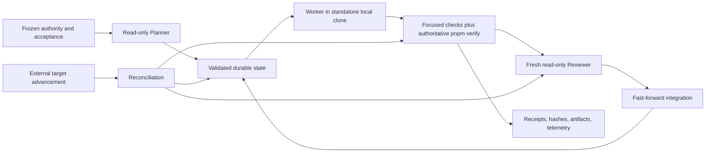

# Correctness and Efficiency Audit

Audit date: 2026-08-05  
Repository: `mclaurin10/milestone-loop-template`  
Audited commit: `a7f5b3db5ab93a7247954a344bcb754a78230ce1`  
Audited tree: `ee6a176185cfc70e2a7a1e21e443095bf8c5be62`  
Branch: `master` (tracking `origin/master`)  
Mode: audit and implementation planning only

## 1. Executive verdict

The repository has a serious, safety-oriented architecture: agent roles are separated, Worker changes occur in standalone local clones, Git integration is fast-forward-only, authoritative verification is parsed rather than inferred from process exit alone, artifacts are contained and hashed, state writes use a temporary file plus `fsync` and rename, and reconciliation has substantially stronger identity and resumption controls than the ordinary milestone path.

It is **not yet safe to treat the template as an autonomous controller suitable for adoption without corrective work**. The strongest defect is that the ordinary verification-to-review transition does not pin the reviewed candidate to the candidate that passed machine verification. A clean commit introduced after verification but before review can become the reviewed and integrated candidate without rerunning machine verification. A second critical trust-boundary defect is that the live Worker protection set omits `scripts/verify.mjs`, `AGENTS.md`, the one-way readiness marker, and `pnpm-lock.yaml`, even though the commissioned manifest declares them protected. In particular, a permitted edit to `scripts/verify.mjs` could alter the authority-producing verifier itself.

Three other documented safety properties are implemented in the opposite direction from their stated intent: ordinary state writes have no cross-process lock or compare-and-swap and can silently lose updates; successful focused commands may be accepted without command-owned receipts; and telemetry failures deliberately turn otherwise successful commands or agent turns into correctness failures. Artifact retention is also automatically destructive at controller start, despite the requested non-destructive retention property and the README's description of non-destructive retention planning.

The current baseline is honestly non-green rather than falsely green. `pnpm verify` selected the default `readiness` profile, returned failure, and marked completion ineligible. Its two `FAIL` stages are explained by the unsupported running Node version and intentional project-owned placeholders; ten further stages are `NOT_READY`. This is expected template incompleteness, not readiness evidence.

The strongest safe efficiency opportunity is exact test ownership. In this repository, `test:unit:fast` runs 37 of 38 discovered files and 202 of 208 tests in about 82 seconds, while `test:orchestrator` runs all 38 files and 208 tests in about 76 seconds. The candidate tier schedules both, and the milestone tier adds the six-test migration partition before an exact full closure that runs all tests again. Making tier partitions an executable, disjoint union can remove a roughly 76-82 second duplicate suite from each candidate run without removing exact closure or the deliberately repeated invariant checks.

The recommended first implementation increment is an end-to-end candidate identity fence: persist a canonical base/commit/tree/clean identity after verification, require the same identity before and after review, include it in the structured review result, recheck it at integration, and add equivalent end-of-run identity checks to direct aggregate and tier verification. This closes the path by which unverified code can be reviewed and integrated and provides a foundation for later receipt and caching work.

## 2. Scope and methodology

This audit treated `PROJECT_GOAL.md` as the frozen product authority, followed by `AGENTS.md`, the repository contract, and the executable-plan documents. No authority, source, test, configuration, schema, dependency, lock, or existing documentation file was edited.

The review covered:

- `README.md`, `PROJECT_GOAL.md`, `AGENTS.md`, `CONTRACT.md`, the plan files, the completed recommissioning manifest, package/workspace configuration, the aggregate verifier, evidence helpers, every live orchestrator configuration file, all orchestrator source/test/schema inventories, and the Ski Tycoon worked example;
- the normal lifecycle from planning through isolated work, checkpointing, verification, review, integration, cleanup, state persistence, retry, and resume;
- direct iteration/candidate/milestone verification, aggregate verification, receipts, retained artifacts, scope selection, telemetry, and evidence retention;
- controller-boundary reconciliation from range capture through fresh verification, review, adoption, and next-proposal queueing;
- recent extraction and genericization history (`0cc2177` through `a7f5b3d`), including blame on the highest-risk control paths;
- real Git/filesystem/subprocess boundaries where a non-mutating or temporary probe was possible.

Classification used in this report:

- **Confirmed defect** means the failure follows directly from an executed probe or an unambiguous reachable source path.
- **Correctness risk** means the source exposes a plausible unsafe platform or failure behavior, but this audit did not reproduce the complete failure end to end.
- **Measured efficiency opportunity** is supported by command timings and exact work-set overlap.
- **Efficiency hypothesis** requires added instrumentation or a repeated benchmark before implementation.
- **Deliberate tradeoff** is duplication or cost that currently protects a required property and should remain.

Two temporary executable probes were used. One passed `AGENTS.md` through the real `loadConfig` and `enforceDiffPolicy` path and observed `allowed: true`. The other created a temporary state directory outside the repository, loaded revision 0 through two `StateStore` instances, saved both, and observed both return revision 1 while the second silently replaced the first. The temporary state directory was removed. Generated repository artifacts are ignored and retained only where explicitly cited below.

No live `loop:run`, `loop:plan`, or external Codex turn was started: those would mutate durable controller state, create workspaces, consume agent budget, and in this checkout fail the configured `main`-branch precondition. That omission is deliberate, not a passing result.

## 3. Repository and architecture map

The repository is a generic controller template rather than a product implementation. `PROJECT_GOAL.md` and the acceptance files are placeholders for an adopter's frozen product contract. The default profile has already crossed the one-way marker to `readiness`, while product-domain checks remain absent or placeholders, so the correct current outcome is non-passing.

| Area                    | Primary implementation                                                               | Boundary or responsibility                                                        |
| ----------------------- | ------------------------------------------------------------------------------------ | --------------------------------------------------------------------------------- |
| Aggregate verification  | `scripts/verify.mjs`                                                                 | Profile/stage selection, exit semantics, completion eligibility, aggregate result |
| Command evidence        | `tools/evidence.mjs`, `tools/run-tool-evidence.mjs`                                  | Manual/focused receipts, hashes, manifests, direct telemetry                      |
| State/controller        | `orchestrator.ts`, `state-store.ts`, `milestone-state.ts`, `transitions.ts`          | Durable lifecycle, retries, resume, cleanup, integration                          |
| Agent boundary          | `planner.ts`, `codex-gateway.ts`, `reviewer.ts`, `agent-schemas.ts`                  | Role prompts, SDK isolation, structured output, accounting                        |
| Git isolation           | `git-isolation.ts`, `path-safety.ts`, `workspace-cleanup.ts`                         | Clone, diff, protected hashes, fast-forward, contained cleanup                    |
| Tier verification       | `verification-tier.ts`, `invariant-suite.ts`, `affected-scope.ts`                    | Iteration/candidate/milestone composition and shadow selection                    |
| Evidence lifecycle      | `verifier.ts`, `artifact-inventory.ts`, `evidence-retention.ts`, `retention-plan.ts` | Receipt validation, inventory, pruning, retention planning                        |
| Reconciliation          | `reconciliation.ts`, `reconciliation-reviewer.ts`                                    | External-gap range, fresh evidence, independent review, adoption                  |
| Configuration/contracts | `config/*.json`, `contracts.ts`, `schema.ts`, `schemas/*.json`                       | Versioned runtime configuration and public data shapes                            |

The orchestrator contains 43 production TypeScript files (24,144 lines), 38 test files (8,948 lines), and 11 JSON Schema files (2,248 lines). The largest control modules are `benchmark.ts` (3,507 lines), `orchestrator.ts` (2,625), `schema.ts` (2,211), `reconciliation.ts` (1,851), `verifier.ts` (1,264), and `artifact-inventory.ts` (1,235). These sizes matter for change isolation but are not themselves correctness defects.

History shows that the complete controller was imported in `0cc2177`; subsequent commits parameterized project vocabulary and shipped generic configuration/examples. The highest-risk verify/review, retention, and state-save code is still attributable to the import commit. This explains why source-project concepts such as D-031 and an exact five-PASS/ten-NOT_READY state remain embedded beneath a generic README.

## 4. Baseline commands and results

### Environment and initial state

| Fact                        | Observed value                                                                        |
| --------------------------- | ------------------------------------------------------------------------------------- |
| Initial Git status          | Clean, `master...origin/master`                                                       |
| HEAD                        | `a7f5b3db5ab93a7247954a344bcb754a78230ce1`                                            |
| Tree                        | `ee6a176185cfc70e2a7a1e21e443095bf8c5be62`                                            |
| Node                        | `v25.9.0`; package requires exact `24.18.0`                                           |
| pnpm                        | `11.15.1`; exact package pin matches                                                  |
| Git                         | `2.54.0.windows.1`                                                                    |
| Install state               | `node_modules` already present; frozen install reported up to date                    |
| Default verify profile      | `readiness`; activation marker present and tracked                                    |
| Configured target branch    | `main`; no local or remote `main` exists; checkout uses `master`                      |
| Controller state            | Absent and reported initializable by doctor; no state was created                     |
| Verification manifest bases | `951e80d...` and `1a4412d...`; the tier base is not an ancestor of this template HEAD |

### Commands

Durations are wall-clock observations from this Windows checkout. They distinguish dominant work but are not presented as statistically stable benchmarks.

| Command                          |                     Exit |                   Approx. duration | Result and evidence                                                                                                                                                                                                               |
| -------------------------------- | -----------------------: | ---------------------------------: | --------------------------------------------------------------------------------------------------------------------------------------------------------------------------------------------------------------------------------- |
| `pnpm install --frozen-lockfile` |                        0 |                              1.2 s | Up to date; Node engine warning; no tracked change                                                                                                                                                                                |
| `pnpm typecheck`                 |                        0 |                              7.8 s | PASS; `artifacts/manual/typecheck-9600/typecheck-report.json`                                                                                                                                                                     |
| `pnpm test:orchestrator`         |                        0 |                             78.2 s | 82 suites / 208 tests PASS; `artifacts/manual/test-orchestrator-11452/orchestrator-report.json`                                                                                                                                   |
| `pnpm lint`                      |                        0 |                             17.6 s | PASS; `artifacts/manual/lint-22208/lint-report.json`                                                                                                                                                                              |
| `pnpm format:check`              |                        0 |                             13.0 s | PASS; `artifacts/manual/format-check-18680/format-report.json`                                                                                                                                                                    |
| `pnpm loop:doctor`               |                        0 |                              4.0 s | Overall `attention`; clean Git, valid config, missing state, local-login auth available, exact Node mismatch                                                                                                                      |
| `pnpm loop:demo-safety`          |                        0 |                              2.0 s | Four synthetic scenarios PASS: same-thread retry, interrupted recovery, retry-limit stop, configured-authority rejection; `artifacts/orchestrator/runs/safety-demonstration/safety-demonstration-20260805131836341-025c2ee0.json` |
| `pnpm verify`                    |                        1 | 121.3 s shell / 119.828 s recorded | Honest readiness failure; `artifacts/verify-2026-08-05T131852-280Z-21980/result.json` and `summary.md`                                                                                                                            |
| `pnpm verify:iteration`          | pnpm shell 1; tier CLI 3 |                              2.2 s | Preflight error: pinned D-031 base is not an ancestor of HEAD                                                                                                                                                                     |
| `pnpm verify:candidate`          | pnpm shell 1; tier CLI 3 |                              2.0 s | Same preflight error                                                                                                                                                                                                              |
| `pnpm verify:milestone`          | pnpm shell 1; tier CLI 3 |                              2.9 s | Same preflight error                                                                                                                                                                                                              |
| `pnpm test:invariants`           |                        1 |                              6.7 s | First invariant failed because focused contract-integrity also includes failing environment; `artifacts/manual/test-invariants-15852/invariant-suite-report.json`                                                                 |
| `pnpm test:unit:fast`            |                        0 |   84.1 s shell / 81.958 s manifest | 37 files, 80 suites, 202 tests PASS; `artifacts/manual/test-unit-fast-9600/`                                                                                                                                                      |
| `pnpm test:unit:migrations`      |                        0 |     6.3 s shell / 4.100 s manifest | 1 file, 2 suites, 6 tests PASS; `artifacts/manual/test-unit-migrations-8516/`                                                                                                                                                     |

`pnpm verify` selected the configured default without an override and started from a clean tree. Stage disposition was 3 PASS, 2 FAIL, and 10 NOT_READY:

- PASS: typecheck (9.420 s), production build (5.783 s), contract integrity (17 ms).
- FAIL: environment (running Node mismatch plus `verify:dependencies` placeholder) and format/lint (format and ESLint passed with valid receipts; `lint:architecture` placeholder failed).
- NOT_READY: unit-domain after the full unit command passed but `test:domain` was missing, plus determinism/replay, save/load, headless, bot, browser, visual, browser diagnostics, performance, and acceptance stages whose required scripts are absent.

The result used exit 1 because `FAIL` outranks `NOT_READY`, and `completion.eligible` was false with `verification_status_not_pass`. That agrees with the documented aggregate semantics. Existing successful child commands in the aggregate had independently validated receipts and hashed artifacts. No readiness or completion claim is supported.

All cited artifacts are under the ignored `artifacts/` root. They are retained because this report explicitly uses them as baseline evidence. The temporary state-race directory was removed. The protection probe wrote no file.

## 5. Preserved correctness invariants

The following controls are sound and should be preserved through every roadmap increment:

| Invariant                      | Assessment                                                                                                                                                                               |
| ------------------------------ | ---------------------------------------------------------------------------------------------------------------------------------------------------------------------------------------- |
| Planner is read-only           | Enforced by role-specific `read-only` sandbox and prompt; structured output is strictly validated by runtime code                                                                        |
| Worker isolation               | Standalone local clone, `--no-hardlinks`, origin removed, dedicated branch, LF configuration, base ancestry check                                                                        |
| Reviewer independence          | Fresh reviewer thread, read-only sandbox, no worker thread reuse, approve only when every boolean is true and no high/critical finding exists                                            |
| Fast-forward-only integration  | Target branch/head/cleanliness checked; candidate fetched from isolated clone; merge uses `--ff-only`; post-merge target reinspection                                                    |
| Verification mutation check    | `verifyMilestone` compares attempt HEAD and cleanliness before and after its command loop; this protects mutations _during_ that function                                                |
| Aggregate status semantics     | `PASS`, `FAIL`, `NOT_READY`, and `ERROR` aggregate with explicit precedence and exit codes; focused/non-default/dirty runs cannot claim completion                                       |
| One-way readiness lifecycle    | Activation marker and Git history checks exist; default full verification recognizes the permanent transition                                                                            |
| Missing checks fail closed     | Missing aggregate scripts become `NOT_READY`; present placeholder scripts fail loudly; neither can pass                                                                                  |
| Authoritative evidence parsing | Run ID, commit, exit, stage set, artifacts, byte sizes, SHA-256, real-path containment, and symlink constraints are independently checked                                                |
| Affected-scope safety          | Selector remains shadow-only and cannot suppress actual candidate/milestone closure                                                                                                      |
| Reconciliation freshness       | Reconciliation has a dedicated lock, durable phases, candidate drift invalidation before adoption, fresh tier verification, and identity-bound independent review                        |
| Retry lineage                  | Same worker thread is resumed for ordinary retries; policy escalation creates a replacement thread with recorded lineage and sanitized evidence                                          |
| Sensitive data controls        | Agent environment allowlist, network disabled by default, event/result redaction, and no credential-content reporting in doctor                                                          |
| Real boundary tests            | Git isolation, path containment, atomic replacement interruption, telemetry recovery, evidence hashing, and reconciliation use real temporary Git/filesystem fixtures in important cases |

Four requested invariants are not currently preserved: exact verified/reviewed identity, complete Worker protection, telemetry non-semanticity, and non-destructive artifact retention. Those are addressed as confirmed defects below rather than being silently redefined.

## 6. Confirmed correctness defects

### C-01 - Ordinary review can adopt a different clean candidate than machine verification

- **Type:** Confirmed defect
- **Severity or priority:** Critical / P0
- **Confidence:** High
- **Affected files/components:** `orchestrator.ts:1927-2104`, `verifier.ts:1068-1263`, `reviewer.ts`, `contracts.ts:531-570`, `schemas/review.schema.json`, `git-isolation.ts:336-350`
- **Observed evidence:** `verifyMilestone` correctly rejects a HEAD change during its own execution (`verifier.ts:1213-1229`). After it returns PASS, `orchestrator.verify` performs another inspection and persists only `workspace.headCommit` (`orchestrator.ts:2032-2049`). On a resumed `review` action, `orchestrator.review` inspects the workspace again but never compares that HEAD to the persisted verified HEAD or authoritative verification identity (`2053-2075`). It submits this newly observed HEAD to the reviewer and integrates it after approval (`2104`). The ordinary review schema has no base/commit/tree or verification-result hash fields. `integrateFastForward` prevents mutation _after the review-side inspection_, but cannot tell that the inspected candidate was never machine-verified.
- **Failure mode or cost:** A clean commit created after verification and before review (for example by a surviving child, another process, manual intervention, or a crash/resume gap) is reviewed and integrated without machine verification. This violates the core rule that verification, review, and integration concern one exact candidate.
- **Why existing tests or controls do or do not catch it:** Tests cover mutation during verification, mutation after approval at `integrateFastForward`, and candidate drift in reconciliation. Search of ordinary orchestrator tests found no clean-commit mutation between persisted `reviewing` state and review entry. Reconciliation has the identity checks that the ordinary path lacks.
- **Recommended change:** Introduce one canonical `CandidateIdentity` containing base commit, candidate commit, tree, clean flag, and a deterministic changed-path/mode digest. Persist it with the verification summary. At review entry, compare the workspace to that exact identity; include the identity and authoritative result hash in reviewer structured output; compare again after review and immediately before integration. Any mismatch invalidates prior verification/review and returns to a safe re-verification state rather than adopting the new candidate.
- **Safety properties that must remain unchanged:** Fresh independent review, no trust in Worker prose, full authoritative verification, fast-forward-only integration, no automatic adoption of external work.
- **Required tests or measurements:** Real-Git fault tests for a dirty edit and clean commit (a) during verification, (b) after verification before review, (c) during review, and (d) after approval; crash/resume at `reviewing`; mismatched review identity; changed tree with unchanged expected state; no integration on every mismatch.
- **Expected benefit:** Eliminates an unverified-integration path and makes candidate identity reusable by receipts, reconciliation, and future safe caches.
- **Implementation complexity:** Medium-high; state/schema migration and reviewer output changes are required.
- **Dependencies or ordering constraints:** Implement first. Later evidence caching or verification deduplication must depend on this identity, not invent another key.

### C-02 - The live protected set omits commissioned controller trust roots

- **Type:** Confirmed defect
- **Severity or priority:** Critical / P0
- **Confidence:** High
- **Affected files/components:** `tools/milestone-orchestrator/config/default.json`, `.agent/completed/loop-recommissioning-verification.json`, `config.ts:162-190`, `orchestrator.ts:1657-1663`, `verifier.ts:1041-1095`, `policy.ts:489-505`, `affected-scope.ts`
- **Observed evidence:** The completed verification manifest declares nine protected paths: the goal, `AGENTS.md`, four eval files, the readiness marker, `scripts/verify.mjs`, and `pnpm-lock.yaml`. Loaded live configuration protects only the goal, four eval files, and the selected config file. The exact set difference is `AGENTS.md`, `.agent/readiness-profile-activated.json`, `scripts/verify.mjs`, and `pnpm-lock.yaml`. An executable probe using real `loadConfig` and `enforceDiffPolicy` evaluated a proposal permitting `AGENTS.md` and a changed-path list containing `AGENTS.md`; the result was `allowed: true`, with no protected or out-of-scope changes. `requiredProtectedPaths` is used by shadow scope and benchmark code, not by ordinary Worker diff enforcement.
- **Failure mode or cost:** A Planner/Worker can receive permitted scope for an omitted trust-root path. Most seriously, it can change `scripts/verify.mjs`, then run the modified verifier as the supposedly authoritative gate. Valid-looking changes to the readiness marker, agent instructions, or dependency lock can also evade the state-captured hash set. Reviewer suspicion is not a machine enforcement boundary.
- **Why existing tests or controls do or do not catch it:** `loop:demo-safety` tests rejection only for a configured authority path, so it passes while the broader manifest/config sets disagree. The policy test likewise uses fixture-configured protected paths. Aggregate immutable-contract checks do not inherently protect the verifier implementation from self-modification.
- **Recommended change:** Define one canonical protected-set builder from mandatory controller trust roots plus configured authority/evals and the selected config/policy sources. Validate at startup that the verification manifest cannot require a path absent from this set. Snapshot and enforce every canonical path in proposal policy, Worker diff policy, verification, review, integration, and reconciliation. Parse rename source and destination and reject case-fold collisions on case-insensitive platforms.
- **Safety properties that must remain unchanged:** Adopters must be able to add stricter protected paths; frozen authority remains human-revision-only; configuration migration stays fail closed; scope selection remains observational.
- **Required tests or measurements:** Set-equality tests against the live manifest; end-to-end attempts to modify every mandatory path, including rename/delete/case-only forms; a compromised-verifier fixture that must be rejected before execution; Windows case-insensitive tests and Unix case-sensitive tests.
- **Expected benefit:** Restores the machine trust boundary around the verifier, lifecycle marker, instructions, and dependency graph.
- **Implementation complexity:** Medium.
- **Dependencies or ordering constraints:** P0, immediately after or parallel to C-01; do not merely add four strings to one JSON file without centralizing the source of truth.

### C-03 - Concurrent ordinary controllers silently lose durable state updates

- **Type:** Confirmed defect
- **Severity or priority:** Critical / P0
- **Confidence:** High
- **Affected files/components:** `state-store.ts:303-338`, `orchestrator.ts:607-770`, `cli.ts`, `reconciliation.ts:940-1008`
- **Observed evidence:** `StateStore.save` validates the caller's in-memory object, increments that object's revision, and atomically replaces the file. It neither locks nor rereads the current on-disk revision. `MilestoneOrchestrator.open/run` has no controller-wide lock; only reconciliation has a dedicated lock. A temporary probe initialized revision 0, loaded it through two stores, saved divergent states, and observed both saves return revision 1; the final file contained only the second writer's value.
- **Failure mode or cost:** Two `loop:run`, `loop:resume`, `loop:plan`, or reconciliation/ordinary processes can overwrite each other's transitions, lose an agent thread ID or completed verification, duplicate a Worker or reviewer turn, and leave Git/state history disagreeing. Atomic replacement prevents a torn JSON file but not lost updates or duplicate side effects.
- **Why existing tests or controls do or do not catch it:** State tests verify single-writer monotonic revision, malformed state, migration, and interrupted replacement. Agent concurrency tests limit invocations inside one process. Reconciliation's lock does not serialize an ordinary process that opened just before reconciliation became active. No cross-process stale-writer test exists.
- **Recommended change:** Add one repository-scoped mutation lease covering all mutating CLI operations, including reconciliation, with a random token, process/host/start identity, bounded stale recovery, and safe release. Add compare-and-swap to `StateStore.save(expectedRevision)` so the lock is defense in depth rather than the sole correctness mechanism. Make initialization exclusive. Persist intent before every external side effect and make re-entry idempotent.
- **Safety properties that must remain unchanged:** Read-only status/doctor remain non-mutating; reconciliation remains resumable; stale lock recovery must never delete a live owner's lease; state writes remain validated and atomic.
- **Required tests or measurements:** Multi-process races for initialize/save/run/reconcile; killed lock owner; PID reuse simulation; stale revision rejection; duplicate agent-start prevention; Windows and Linux lock semantics; crash at every persist/side-effect boundary.
- **Expected benefit:** Prevents lost state, duplicate paid work, and ambiguous recovery.
- **Implementation complexity:** High.
- **Dependencies or ordering constraints:** Complete before relying on revision for identity or cache ownership. Lock/CAS migration must be backward-compatible with existing state.

### C-04 - Automatic controller startup can destructively delete evidence

- **Type:** Confirmed defect
- **Severity or priority:** High / P0 under the required non-destructive retention invariant
- **Confidence:** High
- **Affected files/components:** `orchestrator.ts:971-1023,1170-1218`, `evidence-retention.ts:180-235`, `retention-plan.ts`, `config/default.json:22-25`, retention tests
- **Observed evidence:** Every run invokes `pruneEvidence` before normal work. `pruneManagedEvidenceRuns` selects uncited managed runs outside the recent window and calls `removeContainedPath` on each. Default configuration keeps 20. The test suite explicitly expects old run directories to disappear (`evidence-retention.test.ts:92-127,168-184`). A separate dry-run retention planner exists, but the live controller does not require its plan or human approval before deletion.
- **Failure mode or cost:** Old ignored evidence can be irreversibly removed merely by starting the loop. Citation discovery and safety suspension reduce risk but cannot prove that an uncited artifact has no forensic or human value. This contradicts the required non-destructive artifact-retention behavior and the README's “non-destructive inventory and retention planning” description.
- **Why existing tests or controls do or do not catch it:** Tests catch path escapes and unresolved references, but encode automatic deletion as expected behavior. Legacy IDs, citations, recent-run protection, and reconciliation suspension are useful guards, not explicit authorization.
- **Recommended change:** Make controller startup inventory and write a deletion plan only. Move deletion behind a separate explicit command that consumes an exact plan hash, candidate identity, and artifact-root identity after user approval; refuse stale plans. Prefer trash/quarantine where practical. Keep terminal workspace cleanup as a separately documented temporary-workspace policy rather than conflating it with evidence retention.
- **Safety properties that must remain unchanged:** Real-path containment, symlink rejection, citation preservation, active-state/reconciliation suspension, non-overwrite, and diagnostic retention on failure.
- **Required tests or measurements:** Assert normal `loop:run` never deletes; approval-token and stale-plan tests; cited/unknown/legacy/active run preservation; interruption during quarantine/delete; Windows junction and locked-file behavior.
- **Expected benefit:** Removes an implicit data-loss path while preserving bounded, explicitly authorized housekeeping.
- **Implementation complexity:** Medium.
- **Dependencies or ordering constraints:** Coordinate with the controller-wide lease so inventory and execution cannot race another process.

### C-05 - Focused command evidence is optional or unbound in multiple paths

- **Type:** Confirmed defect
- **Severity or priority:** High / P0
- **Confidence:** High
- **Affected files/components:** `contracts.ts` `VerificationCommand`/`MilestoneProposal`, `agent-schemas.ts:58-80`, `schema.ts:523-555`, `policy.ts:406-431`, `verifier.ts:1116-1263`, `verification-tier.ts:306-360`, `invariant-suite.ts:124-160`, `tools/evidence.mjs:615-658`, `CONTRACT.md`
- **Observed evidence:** Ordinary milestone commands have no expected artifact-kind field; non-`pnpm-verify` commands are accepted from exit status and their receipts are never located or validated. `MilestoneProposal.expectedArtifacts` is validated as a nonempty string array but has no production consumer. Tier and invariant code explicitly accepts a missing `result.json` when `expectedArtifactKinds` is empty. The live manifest assigns empty expected kinds to eight domain commands, and the invariant registry assigns empty kinds to all four commands. This conflicts with `CONTRACT.md`, which requires every successful child/focused verification command to write a receipt with at least one independently validated artifact.
- **Failure mode or cost:** A zero-exit focused command can contribute to candidate or milestone success without proving what it exercised; declared milestone artifacts can be absent without rejection. A hollow repository script can satisfy a milestone-specific check while exact closure lacks a test for the new acceptance criterion.
- **Why existing tests or controls do or do not catch it:** Aggregate `pnpm verify` receipts are strongly validated, and reconciliation requires focused receipts. The tier/invariant missing-receipt branches and empty manifest kinds intentionally bypass that protection. Tests cover plan composition and outcome classification but not “zero exit + no receipt + empty kinds must fail.” Independent review is a valuable additional gate, not a substitute for command ownership.
- **Recommended change:** Extend verification commands with nonempty expected artifact kinds (or a named versioned check contract), inject exact stage/command/artifact environment for every command, require and validate a receipt on every PASS, and compare produced kinds with proposal acceptance/evidence declarations. Reject manifests/registries containing executable checks with empty kinds. Make `writeReceipt` validate nonempty PASS checks/artifacts rather than manufacturing statuses.
- **Safety properties that must remain unchanged:** Full no-argument exact closure, independent artifact hashing/containment, `NOT_READY` for unavailable checks, and no trust in command prose.
- **Required tests or measurements:** Zero-exit/no-receipt; empty-artifact receipt; wrong stage/command; stale receipt; duplicate/missing kind; symlink; hash/size mutation; receipt from another candidate; declared-but-unproduced milestone artifact; failed check passed to helper; reconciliation parity.
- **Expected benefit:** Makes focused verification evidence command-owned and fail closed as documented.
- **Implementation complexity:** High because manifests, proposal schema, wrappers, and examples must migrate together.
- **Dependencies or ordering constraints:** Build on C-01's canonical candidate identity and C-02's protected verifier; do not make current placeholders green during migration.

### C-06 - Telemetry failures change correctness outcomes

- **Type:** Confirmed defect
- **Severity or priority:** High / P0
- **Confidence:** High
- **Affected files/components:** `command-runner.ts:77-123`, `codex-gateway.ts:337-388`, direct evidence helpers, `orchestrator.ts` telemetry phase handling, `command-runner.test.ts:41-60`, README/config documentation
- **Observed evidence:** `recordTelemetry` catches a telemetry write error and rewrites an otherwise successful command summary to `ERROR`. The dedicated unit test asserts exactly that behavior. Codex gateway completion telemetry can also turn a successful turn into a thrown failure, and controller telemetry phase failures escalate a run. README calls telemetry non-semantic; config documentation says telemetry mismatch weakens telemetry, never correctness.
- **Failure mode or cost:** Disk pressure, telemetry corruption, path locking, or a telemetry implementation defect can make verified product behavior fail, consume retries, escalate the controller, and change integration outcomes. This is observability controlling semantics.
- **Why existing tests or controls do or do not catch it:** The behavior is tested, but the test codifies the contradiction. Telemetry hash-chain recovery protects telemetry integrity; it does not justify changing the underlying command or agent result.
- **Recommended change:** Return the original command/agent outcome and record telemetry availability/error as a separate diagnostic. If telemetry is required for a benchmark or optimization claim, make that _claim_ unavailable without relabeling correctness. Ensure telemetry write errors are retained through a minimal fallback channel where possible.
- **Safety properties that must remain unchanged:** Verification receipts remain mandatory; required evidence failures still fail closed; telemetry cannot fabricate timing/token data; corrupt telemetry is never treated as measured.
- **Required tests or measurements:** PASS/FAIL/TIMEOUT results under telemetry open/write/finish failures; successful agent output with telemetry failure; benchmark claim becomes unavailable; no retry-count change from telemetry-only failure; fallback diagnostics do not expose secrets.
- **Expected benefit:** Restores the documented semantic boundary and avoids unnecessary retries/outages.
- **Implementation complexity:** Medium.
- **Dependencies or ordering constraints:** Keep required evidence and optional telemetry APIs distinct before changing call sites.

### C-07 - Direct aggregate and tier results bind only the starting candidate identity

- **Type:** Confirmed defect
- **Severity or priority:** High / P0
- **Confidence:** High
- **Affected files/components:** `scripts/verify.mjs:1591-1731`, `verification-tier.ts:106-138,631-807`, manual evidence context
- **Observed evidence:** `scripts/verify.mjs` captures commit/tree/dirty state once at line 1623, executes every stage, and writes that original identity into the result and completion calculation without a final Git inspection. Tier verification likewise captures once before its command loop and never compares an ending identity. By contrast, ordinary `verifyMilestone` and reconciliation explicitly perform final drift checks.
- **Failure mode or cost:** A verification script that changes or commits tracked content can produce PASS evidence attributed to the pre-change commit/tree. A direct full run could remain completion-eligible based on initial cleanliness. Candidate and iteration tiers can similarly accept commands from a changing worktree.
- **Why existing tests or controls do or do not catch it:** Child commands normally write only ignored artifacts, and the ordinary controller wraps verification with its own drift check. Direct `pnpm verify` is independently advertised as authoritative, however, and tier CLIs are public. Tests validate initial identity and parsed result identity but do not run a mutating passing stage and require final rejection.
- **Recommended change:** Capture and compare canonical identity at the end of every aggregate/tier run and around each reusable command receipt. Any tracked/ref drift is a policy/infrastructure failure, not PASS. Store both observed start/end identities for diagnostics; completion requires equality and final cleanliness.
- **Safety properties that must remain unchanged:** Ignored evidence writes remain allowed; dirty/focused/non-default runs remain ineligible; exact closure remains a fresh process.
- **Required tests or measurements:** Stage that edits tracked content, creates a clean commit, changes index only, changes HEAD/ref only, or performs a case-only rename; ignored-artifact control case; Windows and Unix.
- **Expected benefit:** Makes direct results self-contained and trustworthy outside the orchestrator.
- **Implementation complexity:** Medium; should share C-01's identity utility.
- **Dependencies or ordering constraints:** Implement in the C-01 increment to avoid competing identity formats.

### C-08 - The published ordinary review schema does not describe persisted review artifacts

- **Type:** Confirmed defect
- **Severity or priority:** Medium-high / P1
- **Confidence:** High
- **Affected files/components:** `schemas/review.schema.json:1-14`, `reviewer.ts:89-101`, `schema.ts:674-734`, `schema.test.ts:282-313`, `agent-schemas.ts`
- **Observed evidence:** The JSON Schema sets `additionalProperties: false` and defines only `schemaVersion`, `decision`, `summary`, `findings`, and `checks`. Runtime validation accepts optional `attempt`, `threadId`, and `reviewedAt`, and `requestReview` always adds and persists those fields. The JSON Schema also leaves finding items and checks structurally unconstrained while runtime validation is strict. Schema tests only parse files and inspect `$schema`/`$id`; they never validate runtime artifacts against them.
- **Failure mode or cost:** A standards-compliant consumer rejects genuine persisted reviews, while malformed nested data can appear schema-valid but fail runtime validation. External adopters cannot reliably generate, migrate, or inspect artifacts from the published contract.
- **Why existing tests or controls do or do not catch it:** Hand validation protects the controller itself. Parse-only schema tests share no semantic corpus with runtime validators.
- **Recommended change:** Decide and name separate agent-output and persisted-artifact schemas, or define one schema that includes enriched metadata. Generate or parity-test TypeScript validators, SDK output schemas, and JSON Schemas against a shared positive/negative corpus. Add exact candidate identity as part of C-01.
- **Safety properties that must remain unchanged:** Runtime strictness, unknown-field rejection, structured review independence, schema-versioned migration.
- **Required tests or measurements:** Validate every emitted artifact with its published JSON Schema; run identical malformed corpus through JSON Schema and runtime validator; forward-version rejection/migration tests.
- **Expected benefit:** Eliminates contract ambiguity and makes the template safer to integrate with external tooling.
- **Implementation complexity:** Medium.
- **Dependencies or ordering constraints:** Coordinate with the C-01 review schema change rather than versioning twice.

## 7. Correctness risks requiring further proof

### R-01 - Subprocess timeouts may not stop the process tree or enforce the wall-clock deadline

- **Type:** Correctness risk
- **Severity or priority:** High / P1
- **Confidence:** High for the source gap; medium for every platform-specific failure manifestation
- **Affected files/components:** `command-runner.ts:176-251`, `scripts/verify.mjs:1360-1483`, orchestrator deadline calculation, CLI signal behavior
- **Observed evidence:** The controller runner buffers all stdout/stderr chunks in memory. On timeout it sends one `SIGTERM` and waits indefinitely for `close`; it has no grace-to-force escalation and no process-tree/job-object termination. A command-level `timeoutMs` overrides the controller's remaining-deadline timeout, and multiple sequential commands each receive a timeout computed before the verification phase. The CLI installs no SIGINT/SIGTERM shutdown handler. Aggregate verification escalates to `SIGKILL` after five seconds, but still targets only the immediate child.
- **Failure mode or cost:** On Windows, a wrapper or grandchild can survive, retain pipes, keep mutating a workspace after timeout, and prevent the promise from resolving. Noisy output can exhaust memory. A proposal timeout can exceed the controller wall-clock remainder, and Ctrl-C can leave a child, lease, or externally visible phase without an explicit cancellation record.
- **Why existing tests or controls do or do not catch it:** Verifier tests preserve an injected TIMEOUT classification, but command-runner tests do not spawn stubborn grandchildren, flood output, or exercise signals. Codex turns use `AbortController`, which does not solve subprocess trees.
- **Recommended change:** Introduce a cross-platform process supervisor (Windows Job Object or verified tree-kill strategy; Unix process group), bounded streaming log files with rolling hashes and retained tail, timeout = minimum of command cap and current deadline remainder, force termination after a grace period, and explicit durable cancellation phases.
- **Safety properties that must remain unchanged:** Complete redacted logs or an explicitly declared truncation artifact; TIMEOUT never becomes PASS; no shell interpolation; cancellation never integrates.
- **Required tests or measurements:** Parent/grandchild stubborn processes on Windows and Linux, output flood, pipe retention, SIGINT/SIGTERM at each phase, exact deadline tests with sequential commands, redaction across chunk boundaries.
- **Expected benefit:** Harder execution bounds, deterministic cancellation, lower OOM risk, and safer crash recovery.
- **Implementation complexity:** High and platform-specific.
- **Dependencies or ordering constraints:** Use the global lease from C-03 and candidate fence from C-01 before adding cancellation recovery.

### R-02 - Workspace creation has a junction boundary and diff policy lacks explicit path-type semantics

- **Type:** Correctness risk
- **Severity or priority:** Medium-high / P1
- **Confidence:** Medium
- **Affected files/components:** `git-isolation.ts:158-243,253-333`, `path-safety.ts`, `policy.ts:15-45`, protected snapshots
- **Observed evidence:** Cleanup and inventory use real-path/symlink-aware containment, but `createIsolatedWorkspace` performs only lexical containment before creating/cloning into `workspaceRoot`; it does not reject a pre-existing symlink/junction in the root chain. Changed paths use `git diff --name-only`, with no explicit record of rename source/destination, file mode, symlink, or gitlink/submodule type. Glob matching is case-sensitive even on a case-insensitive filesystem.
- **Failure mode or cost:** A junction can redirect clone creation outside the intended artifact root. Rename/case/file-type edge cases may make proposal/protection policy reason about a different name or object type than Git/Windows does. A permitted path could become a symlink or submodule boundary with semantics not represented by the current string list.
- **Why existing tests or controls do or do not catch it:** Path tests cover cleanup-root junction escape and nested links; package graph rejects symlinked workspaces. Git isolation tests cover normal clone/fast-forward only. There is no workspace-root junction, rename pair, case-only protected rename, file-mode, symlink, or gitlink matrix.
- **Recommended change:** Apply real-path parent-chain checks before clone creation; use NUL-delimited `--name-status`/raw diff parsing that records both rename sides and object modes; define and reject unsupported symlink/gitlink changes; use Git-canonical names and platform-aware collision checks.
- **Safety properties that must remain unchanged:** Standalone no-hardlink clone, repository containment, protected-file hashing, no path traversal, fast-forward-only integration.
- **Required tests or measurements:** Windows junction and case matrix; Unix symlink/mode matrix; rename/delete/copy; submodule gitlink; Unicode normalization; long paths; nested ignored artifacts.
- **Expected benefit:** Closes platform/path ambiguity before it reaches review or cleanup.
- **Implementation complexity:** Medium-high.
- **Dependencies or ordering constraints:** Align with C-02's canonical protected path representation.

### R-03 - Atomic state replacement is not fully crash-durable and recovery lacks a durable backup

- **Type:** Correctness risk
- **Severity or priority:** Medium / P1
- **Confidence:** Medium
- **Affected files/components:** `state-store.ts:19-40,303-338`, migrations and state history
- **Observed evidence:** The temporary state file is opened exclusively, written, file-synced, closed, and renamed. The containing directory is not synced after rename. A corrupt/truncated target fails closed, but ordinary state writes do not retain a last-known-good state record; historical archival is reconciliation-specific.
- **Failure mode or cost:** A power-loss/filesystem crash can lose rename durability on platforms requiring directory sync. If the only target file is corrupt, the controller stops safely but recovery requires manual forensic work with no guaranteed prior snapshot.
- **Why existing tests or controls do or do not catch it:** Tests inject failure before rename and prove the old target survives; they do not emulate post-rename power loss or corrupted-current/valid-backup recovery. Windows and POSIX durability semantics differ.
- **Recommended change:** After C-03 locking, add platform-appropriate directory durability where supported and a bounded, hash-linked last-known-good journal/snapshot written before replacement. Recovery should report and require an explicit safe restore action, not guess.
- **Safety properties that must remain unchanged:** Schema validation before adoption, fail closed on ambiguity, no silent revision rollback, exact state bytes/hashes retained.
- **Required tests or measurements:** Fault injection before/after file sync, rename, directory sync, backup update; corrupt current/valid backup; corrupt both; Windows sharing violation/retry behavior.
- **Expected benefit:** Better recoverability from filesystem and power failures.
- **Implementation complexity:** Medium-high.
- **Dependencies or ordering constraints:** Must follow global lease/CAS so backup rotation is single-writer.

### R-04 - The configured token budget is a preflight threshold, not a hard cap

- **Type:** Correctness risk
- **Severity or priority:** Medium / P1
- **Confidence:** High
- **Affected files/components:** `orchestrator.ts:1237-1382`, `codex-gateway.ts`, model policy
- **Observed evidence:** Consumed tokens are checked before an invocation. The invocation count is durably incremented before the call, which is good, but no reservation or per-turn token ceiling is derived from the remaining budget. One final call can exceed the configured total by its entire usage. Failed/aborted turns may expose no final SDK usage and therefore remain unmeasured.
- **Failure mode or cost:** A nominal “hard” token budget can materially overshoot; stop reasons can imply precise enforcement where the SDK provided only post-turn measurement.
- **Why existing tests or controls do or do not catch it:** Budget tests verify arithmetic and cached-token handling, not last-call overshoot or unavailable failed-turn usage.
- **Recommended change:** Document measured-budget semantics unless the SDK offers an enforceable turn cap. If it does, pass the exact remaining allowance. Otherwise reserve a conservative maximum-turn envelope, stop before a call that cannot fit, and report unavailable failed-turn usage without inventing zero.
- **Safety properties that must remain unchanged:** Invocation counted before side effect, measured usage never fabricated, cached input not double-counted, budget exhaustion stops safely.
- **Required tests or measurements:** Remaining-budget boundary, oversized final turn, timeout with and without usage event, retry accounting, SDK capability/version matrix.
- **Expected benefit:** Accurate cost guarantees and stop reasons.
- **Implementation complexity:** Medium; may depend on SDK capability.
- **Dependencies or ordering constraints:** Do not weaken model/reasoning policy merely to fit an inaccurate budget model.

## 8. Verification and test-suite gaps

The test suite is substantial: 82 reported suites and 208 tests passed, with real temporary Git repositories and filesystem boundaries in several critical modules. Raw line ratios (8,948 test lines to 24,144 production lines) show investment but are not semantic coverage. No coverage provider is installed, so branch/statement percentages were not fabricated.

### T-01 - The suite omits the cross-boundary adversarial cases that expose the P0 defects

- **Type:** Maintainability issue / verification gap
- **Severity or priority:** High / P0-enabling
- **Confidence:** High
- **Affected files/components:** Ordinary orchestrator, state store, command runner, policy/protection, tier/invariant, schema parity tests
- **Observed evidence:** Ordinary tests do not mutate a candidate between verification and review. State tests are single-writer. Safety demonstration rejects only a configured goal path. Tier/invariant tests do not require a receipt when expected kinds are empty. The command-runner test asserts telemetry changes PASS to ERROR. Schema artifact tests merely parse JSON and inspect IDs. Timeout tests inject summaries instead of exercising process trees.
- **Failure mode or cost:** All 208 tests can pass while the verified/reviewed tree differs, state updates are lost, verifier trust roots are mutable, evidence is automatically deleted, and public schemas reject emitted artifacts.
- **Why existing tests or controls do or do not catch it:** Each module test confirms its local current assumption; the missing failures occur between modules or processes. Reconciliation tests demonstrate stronger controls but do not serve as ordinary-path tests.
- **Recommended change:** Add a safety matrix organized by invariant and crash boundary, using real Git/process/filesystem fixtures and the same emitted schemas/receipts as production. Add mutation testing or targeted fault injection for guard removal after core gaps close.
- **Safety properties that must remain unchanged:** Tests must not replace full exact verification, mock away Git/FS/process boundaries, or normalize platform failures as skips.
- **Required tests or measurements:** The tests specified in C-01 through C-08 and R-01 through R-04; run on Windows and Linux; track test IDs to invariant owners and prove exact partition coverage.
- **Expected benefit:** Converts documentation-level safety claims into executable regression gates.
- **Implementation complexity:** High across increments; each P0 should bring its own tests rather than a final test-only sweep.
- **Dependencies or ordering constraints:** Tests precede or accompany each behavior change. Do not first rewrite the large modules.

Additional gaps and controls:

| Area            | What is covered                                                                          | Material missing case                                                                                                                 |
| --------------- | ---------------------------------------------------------------------------------------- | ------------------------------------------------------------------------------------------------------------------------------------- |
| State migration | 1.0/1.2 migrations, malformed state, interrupted pre-rename write                        | Concurrent writers, exclusive initialize, post-rename crash, last-known-good recovery                                                 |
| Git isolation   | Real standalone clone and approved fast-forward                                          | Verify-to-review clean commit, junction root, rename/case/type/submodule matrix                                                       |
| Verification    | Authoritative result/run/artifact validation, timeout status parsing                     | Mutating passing stage, every focused PASS must own receipt, end identity                                                             |
| Reconciliation  | Range metadata, receipt rejection, pre-adoption drift reset, independent identity review | Generic post-D-031 profiles, exact PASS candidate, ordinary/reconciliation startup race, missing target ref/workspace recovery matrix |
| SDK             | Pinned assignment, fresh reviewer, same worker resume, max in-process concurrency        | Malformed/oversized event stream, process cancellation, failed-turn token accounting, cross-process duplicate invocation              |
| Retention       | Citation/legacy/recent preservation, path containment, suspension                        | Explicit approval requirement and stale deletion plan                                                                                 |
| Schemas         | Runtime validators have positive/negative cases                                          | Runtime-vs-JSON-Schema parity and emitted-artifact conformance                                                                        |

## 9. Measured efficiency findings

### E-01 - Candidate and milestone tiers repeat nearly identical full orchestrator test work

- **Type:** Measured efficiency opportunity
- **Severity or priority:** P2 after correctness fixes
- **Confidence:** High for overlap and local cost; medium for end-to-end savings until the tier base is commissioned
- **Affected files/components:** `.agent/completed/loop-recommissioning-verification.json`, `invariant-suite.ts`, `tools/run-tool-evidence.mjs`, `vitest.config.ts`, slow-suite registry
- **Observed evidence:** Full discovery is 38 files / 208 tests. `test:unit:fast` is an exact partition of 37 files / 202 tests and took 81.958 seconds inside its manifest. The migration partition is 1 file / 6 tests and took 4.100 seconds. `test:orchestrator` targets `tools/milestone-orchestrator`, which is the entire current Vitest include set, and ran all 208 tests in 75.818 seconds. The candidate manifest schedules invariants, fast unit, and full orchestrator. Milestone also schedules migration, then exact `pnpm verify`, whose unit stage again ran all 208 tests in 77.160 seconds. Invariants intentionally repeat three safety files.
- **Failure mode or cost:** Candidate verification pays for the same 202 tests twice; milestone pays for those tests in fast, full orchestrator, and exact full closure, plus the migration subset separately. The dominant suite accounts for about 64% of the measured 119.828-second aggregate verify.
- **Why existing tests or controls do or do not catch it:** `invariant-suite.test.ts` proves only fast+migration is a disjoint complete partition; it does not assert disjoint ownership across `test-unit-fast` and `test-orchestrator`. Exact closure repetition is deliberate defense in depth and should remain.
- **Recommended change:** Define executable test ownership: product fast tests, orchestrator fast tests, and migration tests must be disjoint, with a registry test proving their union equals discovery. Point candidate/milestone focused commands at the disjoint partitions. Keep always-run invariants even when they overlap and keep fresh exact no-argument verification at milestone/periodic closure.
- **Safety properties that must remain unchanged:** No test disappears from the union; invariant commands always run; exact closure is a fresh process; affected scope cannot suppress closure; failed partitions stop the tier.
- **Required tests or measurements:** File/test-ID union and intersection assertions; before/after three-run warm benchmark on representative adopter; failure injection in each partition; unchanged exact stage/test counts.
- **Expected benefit:** Approximately 76-82 seconds removed from each candidate run in this repository, with larger milestone savings, without reducing exact or invariant coverage.
- **Implementation complexity:** Low-medium.
- **Dependencies or ordering constraints:** Do after P0 evidence/candidate fixes so the new partitions produce mandatory receipts and are identity-bound.

### Measured cost profile

| Work                               |                       Observed duration | Interpretation                                                       |
| ---------------------------------- | --------------------------------------: | -------------------------------------------------------------------- |
| Full unit/orchestrator Vitest      | 75.8-77.2 s in two independent wrappers | Dominant, stable enough to classify as material                      |
| Fast 37-file partition             |                                  82.0 s | “Fast” is nearly full and not a short edit loop here                 |
| Migration 1-file partition         |                                   4.1 s | Partition is useful, but duplicated by full orchestrator/exact runs  |
| Format + lint + architecture stage |                                  26.4 s | 25.0 s was successful formatter/ESLint work; placeholder added 1.4 s |
| Typecheck                          |                               7.8-9.4 s | Material but much smaller than tests; incremental tool already used  |
| Production build                   |                                   5.8 s | Small relative to suite                                              |
| Aggregate verify total             |                        119.8 s internal | Stage sum is mostly test plus format/lint                            |

No recommendation is made to cache or remove the exact full closure based only on these timings. Its freshness and different authority role are intentional.

## 10. Efficiency hypotheses requiring instrumentation

### H-01 - Some read-only verification stages may safely overlap

- **Type:** Efficiency hypothesis requiring instrumentation
- **Severity or priority:** P3
- **Confidence:** Medium
- **Affected files/components:** `scripts/verify.mjs`, evidence directory ownership, workspace typecheck cache, build outputs
- **Observed evidence:** Aggregate stages are serialized. Formatter and ESLint consumed about 25 seconds; typecheck and build another 15 seconds. Artifact directories are distinct, but TypeScript caches, build outputs, CPU, and filesystem traversal may contend.
- **Failure mode or cost:** Blind parallelism can create cache races, resource contention, nondeterministic logs, or misleading duration evidence.
- **Why existing tests or controls do or do not catch it:** No declared read/write resource graph or serial-vs-parallel benchmark exists.
- **Recommended change:** Instrument file writes, CPU/memory, and stage dependency declarations; parallelize only stages proven read-only or output-disjoint; retain deterministic result ordering and command-owned receipts.
- **Safety properties that must remain unchanged:** Same checks/artifacts, fail-closed status, deterministic identity, no shared-cache corruption.
- **Required tests or measurements:** At least five warm serial/parallel runs on Windows and Linux, resource contention, forced failures, artifact/hash equality.
- **Expected benefit:** Potential 10-25 second wall-time reduction, unproven.
- **Implementation complexity:** Medium.
- **Dependencies or ordering constraints:** After E-01; deduplication may remove enough cost that parallelism is unnecessary.

### H-02 - Exact-identity caching could avoid unchanged deterministic controller checks

- **Type:** Efficiency hypothesis requiring instrumentation
- **Severity or priority:** P3
- **Confidence:** Low-medium
- **Affected files/components:** tier planner, receipts, package graph, typecheck/build, config/manifest hashing
- **Observed evidence:** Config, manifest, package graph, test discovery, hashes, and controller-only checks are recomputed in multiple processes. Their isolated cost was not measured, and validation of a cache may approach the work being cached.
- **Failure mode or cost:** An under-keyed cache can reuse evidence for a different candidate, toolchain, environment, command definition, or protected set, directly weakening correctness.
- **Why existing tests or controls do or do not catch it:** No cache exists. Candidate identity is currently incomplete across boundaries.
- **Recommended change:** First instrument time by operation. Cache only deterministic results keyed by canonical candidate tree, command argv/implementation hash, lock/toolchain/environment identity, protected-set hash, and schema version. Exact milestone/periodic closure should remain fresh unless the frozen contract is explicitly revised with equivalent proof.
- **Safety properties that must remain unchanged:** Command-owned evidence, candidate binding, no stale acceptance, no cache support for completion without an explicitly authorized equivalence proof.
- **Required tests or measurements:** Key omission mutation matrix, poisoned cache, interrupted write, cross-platform key stability, hit-validation cost versus recomputation.
- **Expected benefit:** Unknown; likely small for parsing/hashing and potentially material for typecheck/build.
- **Implementation complexity:** High.
- **Dependencies or ordering constraints:** Requires C-01/C-07 identity, C-05 receipts, and C-03 single-writer ownership.

### H-03 - Clone, retention scan, and telemetry costs need production-scale traces

- **Type:** Efficiency hypothesis requiring instrumentation
- **Severity or priority:** P3
- **Confidence:** Low
- **Affected files/components:** Git isolation, artifact inventory/retention, telemetry store/report
- **Observed evidence:** This small template did not provide representative repository size, artifact history, or networked filesystem conditions. The full clone uses safe no-hardlink local isolation; retention scans and telemetry use repeated filesystem operations.
- **Failure mode or cost:** Replacing clones with worktrees reintroduces shared Git metadata and cleanup hazards; optimizing scans without reference completeness risks deletion; batching telemetry can lose crash evidence.
- **Why existing tests or controls do or do not catch it:** Benchmark matrix is source-project-specific and tier base is unusable here. No scale trace was collected.
- **Recommended change:** Add timings/bytes for clone, Git probes, state serialization, inventory traversal, telemetry fsync, and cleanup on representative repositories. Optimize only a measured dominant operation.
- **Safety properties that must remain unchanged:** Standalone isolation, no hardlinks, crash-readable telemetry, containment, no automatic evidence deletion.
- **Required tests or measurements:** Repository size matrix, long paths, antivirus/network filesystem, 10/100/1000 evidence runs, crash injection.
- **Expected benefit:** Unknown.
- **Implementation complexity:** Instrumentation low; any redesign high.
- **Dependencies or ordering constraints:** Keep current clone design until evidence supports an alternative.

### H-04 - Agent context is already reasonably compact; role/model changes require outcome benchmarks

- **Type:** Efficiency hypothesis requiring instrumentation
- **Severity or priority:** P3
- **Confidence:** Medium
- **Affected files/components:** planner/worker/reviewer prompts, model policy, retry/escalation telemetry
- **Observed evidence:** Prompts mostly direct agents to read local authority rather than embedding whole files. Planner receives compact milestone summaries. Ordinary retries reuse the same thread; replacement workers receive bounded (50 KB) diff and sanitized failure summaries. Models are pinned by role, and deterministic code handles policy/state decisions. No role-level token/duration/success distribution exists for this template.
- **Failure mode or cost:** Cheaper models, narrower reviewer scope, or removed context can miss authority conflicts or suspicious shortcuts. Re-sending less context may increase retries and total tokens.
- **Why existing tests or controls do or do not catch it:** SDK tests validate assignment and accounting mechanics, not outcome quality by model/prompt variant.
- **Recommended change:** Measure tokens, wall time, retry rate, reviewer reversal rate, and escaped-defect rate by role and milestone class. Only then consider compact structured references, difficulty routing, or prompt deltas.
- **Safety properties that must remain unchanged:** Planner read-only, Worker scope, reviewer independence and exact diff, pinned/versioned model policy, no hidden feedback leakage.
- **Required tests or measurements:** Paired replay corpus with seeded defects, role-level cost/quality confidence intervals, no acceptance regressions.
- **Expected benefit:** Unknown; potentially material on long histories.
- **Implementation complexity:** Medium-high.
- **Dependencies or ordering constraints:** Candidate identity and telemetry non-semantic fixes first; do not optimize with unreliable telemetry.

## 11. Adoption and maintainability findings

### A-01 - The tier and reconciliation protocol remains pinned to source-project D-031 state

- **Type:** Adoption hazard / confirmed limitation
- **Severity or priority:** High / P1
- **Confidence:** High
- **Affected files/components:** `.agent/completed/loop-recommissioning-verification.json`, `verification-tier.ts:642-646`, `verifier.ts:90-232`, `reconciliation-reviewer.ts:20-33`, `reconciliation.ts:1436-1437`, README/CONTRACT adoption steps
- **Observed evidence:** All three tier commands fail before creating a tier run because `1a4412d...` is not an ancestor of template HEAD. Reconciliation verification requires tier and exact status `NOT_READY`, exact exit 2, and exactly five PASS plus ten NOT_READY stages. Reviewer prompts and check IDs explicitly require D-031 scope/migration/Worker parity and a D-031 subrange. A future candidate that makes a sixth stage pass or reaches full PASS is rejected by this validator. The genericization commits retained these source-specific semantics.
- **Failure mode or cost:** A fresh adopter must know how to replace multiple hashes, check IDs, expected counts, historical benchmark boundaries, and D-031 review semantics. Reconciliation can reject a healthier readiness state, and every tier is permanently unusable until manual repinning is exact.
- **Why existing tests or controls do or do not catch it:** Reconciliation and manifest tests use fixtures reproducing the same five/ten and D-031 assumptions. README tells adopters to author/repin files but provides no generator or semantic commissioning validator.
- **Recommended change:** Separate a generic reconciliation protocol from an optional, versioned historical-commissioning section in the manifest. Validate semantic stage monotonicity from the adopter's actual manifest instead of fixed counts. Provide a setup/commission command that discovers branch/HEAD/checks, emits a reviewable manifest and semantic diff, and never rewrites frozen hashes without explicit authorization.
- **Safety properties that must remain unchanged:** Fresh verification, independent identity-bound review, complete external commit range, no invented history, no automatic acceptance of a healthier-looking but unproven candidate.
- **Required tests or measurements:** Fresh generic repo, partial readiness with arbitrary pass count, full PASS, manifest evolution, stale historical section, source worked example compatibility, rejected scope reduction.
- **Expected benefit:** Makes tiers and reconciliation usable without hidden source-project knowledge.
- **Implementation complexity:** High.
- **Dependencies or ordering constraints:** Candidate/protected/evidence contracts first; version the manifest and migration explicitly.

### A-02 - Doctor validates syntax but misses operational branch and tier preconditions

- **Type:** Adoption hazard
- **Severity or priority:** Medium-high / P1
- **Confidence:** High
- **Affected files/components:** `doctor.ts:121-160,194-270`, default config, verification manifest, README setup flow
- **Observed evidence:** The live config names target branch `main`; the repository has only `master`/`origin/master`. Doctor reports configuration valid and state missing/initializable because its Git probe checks only cleanliness and HEAD, not target branch/ref existence or agreement. It also does not validate tier-base ancestry, canonical protected-set agreement, placeholder command inventory, or whether every manifest command can own required evidence. Tier commands then fail with an ancestry stack trace.
- **Failure mode or cost:** An adopter receives a superficially healthy diagnostic but cannot start the controller or any tier. Manual edits are discovered one failure at a time, increasing the chance of permanently NOT_READY or internally inconsistent configuration.
- **Why existing tests or controls do or do not catch it:** Doctor tests assert read-only runtime/config/state/auth reporting; no test requires operational target/tier readiness. README assigns these edits to the user.
- **Recommended change:** Add a read-only commissioning/preflight mode with separate “syntax valid,” “bootstrap runnable,” “tier commissioned,” and “readiness runnable” outcomes. Check target ref, base ancestry, protected-set consistency, placeholders, scripts, receipt contracts, marker/profile relationship, and worked-example leftovers. Keep attention/nonzero semantics explicit for automation.
- **Safety properties that must remain unchanged:** Doctor never creates state, exposes credentials, changes Git, or calls an agent; incomplete configuration never passes as readiness.
- **Required tests or measurements:** Current `master`/`main` mismatch, missing/renamed branch, stale base, placeholder inventory, invalid receipt kinds, valid fresh adoption, JSON/terminal exit semantics.
- **Expected benefit:** Faster, safer adoption with actionable diagnostics instead of downstream stack traces.
- **Implementation complexity:** Medium.
- **Dependencies or ordering constraints:** Reuse canonical validators from C-02/C-05 and the generic manifest from A-01.

### A-03 - Contract definitions are duplicated without semantic parity tests

- **Type:** Maintainability issue
- **Severity or priority:** Medium / P1-P2
- **Confidence:** High
- **Affected files/components:** `contracts.ts`, `schema.ts`, `agent-schemas.ts`, `schemas/*.json`, `scripts/verify.mjs`, config manifests
- **Observed evidence:** The same shapes and IDs are encoded in TypeScript interfaces, hand validators, SDK structured-output schemas, published JSON Schemas, aggregate-verifier literals, and JSON configuration. C-02, C-05, C-08, and A-01 are concrete drift examples. The schema suite checks parseability rather than semantic parity.
- **Failure mode or cost:** A change can be valid in one layer and rejected, ignored, or weakened in another. Adopters must manually repin and update several representations.
- **Why existing tests or controls do or do not catch it:** Runtime validators are individually strong, but there is no generated source of truth or shared conformance corpus.
- **Recommended change:** Establish one versioned contract catalogue that generates or validates JSON Schema, SDK output schema, runtime validators, manifest IDs, and docs. Use executable semantic-diff tooling for migrations; preserve independently implemented artifact verification where duplication is intentional defense in depth.
- **Safety properties that must remain unchanged:** Independent evidence revalidation must not be replaced by trusting a producer's shared helper; unknown fields and unsupported versions fail closed.
- **Required tests or measurements:** Cross-validator corpus, generated-file drift check, migration fixtures, malicious/malformed inputs, independent hash/artifact validator differential tests.
- **Expected benefit:** Fewer adoption errors and safer schema evolution.
- **Implementation complexity:** High if fully generated; medium for parity corpus first.
- **Dependencies or ordering constraints:** Start with parity tests during C-01/C-05; do not undertake a wholesale generator rewrite before P0 fixes.

### A-04 - Large phase-spanning modules raise correction risk

- **Type:** Maintainability issue
- **Severity or priority:** P3
- **Confidence:** Medium-high
- **Affected files/components:** `benchmark.ts`, `orchestrator.ts`, `schema.ts`, `reconciliation.ts`, `verifier.ts`, `artifact-inventory.ts`
- **Observed evidence:** Six modules are 1,200-3,500 lines and combine parsing, policy, I/O, lifecycle, telemetry, and artifact construction. Ordinary and reconciliation paths have parallel but unequal identity/review controls. History imported these modules as a single large change, making intent harder to recover.
- **Failure mode or cost:** Small safety fixes touch broad files, reviewers miss phase interactions, and stronger reconciliation behavior does not naturally propagate to the ordinary path.
- **Why existing tests or controls do or do not catch it:** Tests are module-oriented and substantial, but cross-module gaps remain. Size alone is not a failing test.
- **Recommended change:** After characterization and P0 fixes, extract pure candidate identity, lease/state transaction, receipt contract, phase transition, and review-binding components. Keep adapters thin and preserve public schemas. Avoid cosmetic splitting that merely moves lines.
- **Safety properties that must remain unchanged:** State transitions remain explicit, no hidden side effects, independent validation layers remain independent, recovery remains resumable.
- **Required tests or measurements:** Characterization tests before extraction, API dependency graph, mutation/fault suite unchanged, compile and runtime performance comparison.
- **Expected benefit:** Lower change risk and easier adopter extension.
- **Implementation complexity:** High.
- **Dependencies or ordering constraints:** P3, after P0/P1 behavior is pinned by tests.

## 12. Deliberate tradeoffs and “do not optimize” controls

These costs are justified unless new evidence proves an equally safe alternative:

- **Keep fresh no-argument exact closure.** Focused tiers guide iteration; they must not manufacture readiness or completion authority.
- **Keep always-run invariants even where they overlap.** Their purpose is stable safety ownership. E-01 removes broad accidental overlap, not the four commissioned invariants.
- **Keep affected-scope shadow-only.** Do not skip checks from recommendations until the frozen graduation criteria are met with measured false-negative evidence.
- **Keep standalone local clones with `--no-hardlinks`.** Worktrees share Git metadata and make cancellation/cleanup/ref races materially harder. Measure before redesigning.
- **Keep independent review in a fresh read-only thread.** Reusing Worker/planner context would reduce tokens by sacrificing independence.
- **Keep fail-loud placeholders and `NOT_READY` for missing commands.** Do not turn incomplete template wiring into PASS to improve the baseline.
- **Keep independent receipt/artifact validation.** Producer and consumer duplication here is defense in depth; centralize shape definitions without trusting producer assertions.
- **Keep serial agent invocation.** Parallel Planner/Worker/Reviewer turns conflict with the state machine and budget lineage. Deterministic non-agent checks may be parallelized only after resource proof.
- **Keep protected immutable hashes and one-way readiness history.** Adoption tooling may generate reviewable inputs but must not silently rewrite the frozen baseline.
- **Keep failure workspaces/evidence until an explicit lifecycle rule applies.** Automatic deletion is not an acceptable efficiency optimization.

Rejected or deferred ideas:

- Removing exact verification because focused tests passed: rejected; weakens authority and freshness.
- Letting a cache support completion from tree hash alone: rejected; omits toolchain, command, environment, protected set, and evidence identity.
- Replacing local clones with worktrees immediately: deferred pending representative safety/performance benchmarks.
- Parallelizing all stages or agents: rejected without a read/write resource graph and deterministic evidence ordering.
- Downgrading Planner/Reviewer models based only on token cost: deferred pending seeded-defect quality benchmarks.
- Treating telemetry as required correctness evidence: rejected; availability should affect telemetry claims, not product correctness.
- Automatically pruning uncited artifacts: rejected under the non-destructive retention requirement.
- Making placeholder commands exit zero or converting real failure to NOT_READY: rejected; would create false green states.

## 13. Prioritized change roadmap

Each increment is intentionally cohesive. None authorizes product features or a readiness claim.

### P0 - Confirmed correctness defects

#### P0.1 - End-to-end candidate identity fence

- **Exact objective:** Prove that verification, review, and integration use one unchanged base/commit/tree/clean candidate in ordinary, aggregate, and tier paths.
- **Likely files/components:** New candidate-identity module; `orchestrator.ts`, `verifier.ts`, `verification-tier.ts`, `scripts/verify.mjs`, `reviewer.ts`, contracts/schemas/state migration, Git isolation.
- **Preconditions:** Clean tree; run with Node 24.18.0; preserve current result schema through an explicit version migration.
- **Implementation outline:** Canonical identity capture; persist verified identity and result hash; pre/post review comparison; structured review echo; integration comparison; final aggregate/tier comparison; safe invalidation transition.
- **New or changed tests:** Real-Git four-window mutation matrix, crash/resume, dirty/index/ref/case changes, review mismatch, ignored-artifact control.
- **Focused verification:** Typecheck; candidate-identity, verifier, reviewer, orchestrator, Git-isolation, schema tests.
- **Broader verification:** Full `pnpm test:orchestrator`; `pnpm loop:demo-safety`; aggregate verify interpreted as template non-pass until placeholders are commissioned.
- **Benchmark or telemetry needed:** Record identity capture overhead; it should be negligible relative to Git verification.
- **Rollback strategy:** One cohesive commit; revert schema/code/tests together. Do not retain partially migrated state support.
- **Completion criteria:** No test can integrate or issue completion evidence after any tracked/ref identity drift; emitted review/result artifacts validate under versioned schemas.

#### P0.2 - Canonical protected trust-root set

- **Exact objective:** Make all policy, snapshot, verification, review, and integration boundaries enforce the same complete protected set.
- **Likely files/components:** Config loader, manifest validator, policy/verifier/orchestrator, Git diff parser, safety demo, default/templates/examples/docs.
- **Preconditions:** P0.1 identity representation available.
- **Implementation outline:** Canonical mandatory+configured set; startup equality check; snapshot all; rename/source/destination/type enforcement; explicit case-fold collision behavior.
- **New or changed tests:** Every mandatory path and operation form; compromised verifier; live config/manifest equality; Windows case matrix.
- **Focused verification:** Policy, config, verifier, affected-scope, Git/path, safety-demo tests and command.
- **Broader verification:** Full orchestrator suite and aggregate contract-integrity stage.
- **Benchmark or telemetry needed:** Protected hashing cost by path count/size; no cache until identity-safe.
- **Rollback strategy:** Revert as one contract-versioned change; never roll back by shrinking the set for green tests.
- **Completion criteria:** The executable probe for each commissioned path is rejected before Worker verification; no set drift is possible without a loud config error.

#### P0.3 - Single-writer lease plus state compare-and-swap

- **Exact objective:** Prevent concurrent mutation, lost revisions, and duplicate external side effects.
- **Likely files/components:** State store, CLI, orchestrator/reconciliation open/run, new lease module/schema, doctor/status.
- **Preconditions:** Define lease recovery semantics for Windows/Unix and a backward-compatible state migration.
- **Implementation outline:** Repository-wide mutation lease; exclusive initialize; CAS expected revision; intent-before-side-effect; robust owner token; safe stale recovery; read-only commands remain lock-free.
- **New or changed tests:** Real multi-process races, killed owner, PID reuse, stale revision, duplicate agent/reviewer/integration, ordinary/reconciliation race.
- **Focused verification:** State, CLI, deterministic operations, reconciliation, cleanup tests.
- **Broader verification:** Full orchestrator and safety demonstration on Windows and Linux.
- **Benchmark or telemetry needed:** Lease/state write latency and contention diagnostics.
- **Rollback strategy:** Feature-gated migration only during development; final commit must not allow old unlocked mutation path.
- **Completion criteria:** The two-writer probe rejects one writer with an actionable stale-revision/lease error and retains the first update; no duplicate external call occurs.

#### P0.4 - Mandatory focused command receipts

- **Exact objective:** Require every successful focused/invariant/milestone command to own a validated nonempty artifact receipt bound to candidate and command identity.
- **Likely files/components:** Proposal/verification contracts, SDK/JSON schemas, evidence helper, verifier/tier/invariant, manifests/templates/examples, wrappers.
- **Preconditions:** P0.1 identity and P0.2 verifier protection.
- **Implementation outline:** Versioned check contract with required kinds; evidence environment for all commands; fail closed on absent/malformed/stale receipt; make `expectedArtifacts` executable or remove it via explicit schema migration.
- **New or changed tests:** Complete malformed/stale/empty/wrong-kind/candidate/symlink/hash matrix and hollow zero-exit scripts.
- **Focused verification:** Evidence, artifact inventory, verifier, tier, invariant, policy/schema tests.
- **Broader verification:** Full orchestrator, safety demo, and a commissioned example tier.
- **Benchmark or telemetry needed:** Receipt validation bytes/time; confirm it is small relative to command work.
- **Rollback strategy:** Revert contract/manifests/wrappers together; never add a compatibility mode that treats missing receipts as PASS.
- **Completion criteria:** No PASS command record has `receipt: null` or zero validated artifacts; current empty-kind manifest entries are rejected until implemented.

#### P0.5 - Restore telemetry non-semanticity

- **Exact objective:** Ensure telemetry availability cannot change command, agent, verification, review, or integration correctness outcomes.
- **Likely files/components:** Command runner, Codex gateway, telemetry store/callers, result diagnostic schemas, tests.
- **Preconditions:** Distinguish required evidence from optional telemetry in types.
- **Implementation outline:** Preserve underlying result; report telemetry availability/error separately; make benchmark/efficiency claims unavailable when telemetry is missing; retain minimal fallback diagnostic.
- **New or changed tests:** Telemetry open/append/finalize corruption against every underlying status and agent result.
- **Focused verification:** Command-runner, gateway, telemetry store/report, verifier tests.
- **Broader verification:** Full orchestrator suite and safety demo.
- **Benchmark or telemetry needed:** None for semantics; measure fallback overhead later.
- **Rollback strategy:** Revert as one behavior/test change; required receipt errors remain semantic throughout.
- **Completion criteria:** Injected telemetry failure never changes the underlying outcome or retry/integration decision, and no telemetry claim is fabricated.

#### P0.6 - Make artifact retention approval-bound

- **Exact objective:** Make normal controller execution non-destructive and require an exact explicit approval for evidence removal.
- **Likely files/components:** Orchestrator startup, evidence retention, retention plan/CLI, config/schema/docs, path safety.
- **Preconditions:** P0.3 lease; decide quarantine/trash support.
- **Implementation outline:** Startup inventory/dry-run only; signed/hashed plan artifact; explicit execution command; stale-plan rejection; quarantine where available.
- **New or changed tests:** No-delete run, approval/staleness, all preservation classes, interruption, junction/locked file.
- **Focused verification:** Retention, inventory, path safety, orchestrator cleanup tests.
- **Broader verification:** Full orchestrator and dry-run/manual approval smoke on both platforms.
- **Benchmark or telemetry needed:** Inventory and approved cleanup time at scale.
- **Rollback strategy:** Revert deletion executor while leaving dry-run; never restore implicit startup deletion.
- **Completion criteria:** `loop:run` cannot delete evidence; only a user-approved exact plan can, with a durable result.

### P1 - Correctness hardening and recovery

#### P1.1 - Cross-platform process supervision and cancellation

- **Exact objective:** Enforce process-tree termination, bounded logs, actual remaining deadlines, and durable cancellation.
- **Likely files/components:** Command runner, aggregate subprocess runner, CLI, orchestrator phase state, platform adapter, result schemas.
- **Preconditions:** P0.3 lease and P0.1 identity are active; supported Windows and Unix termination semantics are documented.
- **Implementation outline:** Persist cancellation intent; stream redacted bounded logs; launch a managed process group/job; terminate gracefully then forcibly; use the minimum command/config/deadline allowance; persist the terminal outcome.
- **New or changed tests:** Stubborn grandchildren, output flood, signals at each phase, Windows/Unix, redaction across chunks, deadline override.
- **Focused verification:** Command-runner, CLI, verifier, and recovery tests plus a real process-tree smoke.
- **Broader verification:** Full orchestrator suite, safety demonstration, and aggregate verification under a forced timeout.
- **Benchmark or telemetry needed:** Normal spawn/log overhead, memory ceiling, and termination latency.
- **Rollback strategy:** Revert the process-supervisor adapter and schema together; do not restore indefinite timeout behavior as a compatibility path.
- **Completion criteria:** No child survives a terminal timeout/cancellation, memory remains bounded, and every interrupted phase resumes or stops unambiguously.

#### P1.2 - Filesystem durability and path-type hardening

- **Exact objective:** Add recoverable state durability and unambiguous path/object semantics at clone, diff, and cleanup boundaries.
- **Likely files/components:** State store/history, Git isolation, path safety, protected policy, workspace cleanup, platform utilities.
- **Preconditions:** P0.2 canonical paths and P0.3 single-writer state are active.
- **Implementation outline:** Detect platform durability support; sync directory or record explicit limitation; keep a hash-linked last-known-good state; inspect workspace parent real paths; parse raw rename/object-mode diffs; reject unsupported link/gitlink changes.
- **New or changed tests:** Every state crash point, corrupt current/backup combinations, junctions, rename/case/symlink/gitlink, long and Unicode paths.
- **Focused verification:** State, Git-isolation, path-safety, protected-policy, and cleanup suites on Windows and Linux.
- **Broader verification:** Full orchestrator suite and safety demonstration on both platforms.
- **Benchmark or telemetry needed:** State fsync/journal latency and raw-diff overhead on small and large changes.
- **Rollback strategy:** Journal and diff adapters remain separable cohesive commits; a rollback must retain fail-closed behavior and never guess state.
- **Completion criteria:** Every ambiguous path or crash state either recovers from exact hash-linked evidence or stops with an actionable, non-destructive procedure.

#### P1.3 - Generic commissioning and reconciliation protocol

- **Exact objective:** Remove mandatory D-031/five-ten coupling and provide a safe, discoverable commissioning path for a generic adopter.
- **Likely files/components:** Verification manifest/schema, tier planner/parser, reconciliation/reviewer, doctor/CLI, README/CONTRACT, templates and worked example.
- **Preconditions:** P0 identity, protected-set, receipt, and schema contracts are versioned.
- **Implementation outline:** Version the manifest; model optional historical boundaries explicitly; derive semantic monotonic expectations from actual stages; add read-only preflight and a separate explicit generator for reviewable inputs.
- **New or changed tests:** Empty generic repository, partial and full readiness, worked example, stale bases, manifest migration, and scope-reduction rejection.
- **Focused verification:** Config, doctor, tier, reconciliation, reviewer, and schema tests; execute all tier modes in a commissioned fixture.
- **Broader verification:** Full orchestrator suite, safety demo, and fresh-clone adoption rehearsal.
- **Benchmark or telemetry needed:** Manual step count, time to first actionable diagnostic, and preflight runtime.
- **Rollback strategy:** Read the old manifest for one explicit migration version; never silently reinterpret its historical facts.
- **Completion criteria:** A fresh adopter reaches truthful bootstrap and can commission readiness/tier/reconciliation behavior without source-project hashes or hidden instructions.

#### P1.4 - Contract/schema parity and accurate budget semantics

- **Exact objective:** Align emitted and published schemas and make token/deadline terminology and enforcement match measurable behavior.
- **Likely files/components:** Contracts, runtime validators, SDK schemas, JSON Schemas, evidence emitters, budget/model policy, Codex gateway.
- **Preconditions:** Incorporate all P0 schema changes and decide whether the installed SDK supports an enforceable per-turn token cap.
- **Implementation outline:** Build a shared conformance corpus; validate emitted artifacts; generate or parity-check schemas; enforce a real remaining cap or reserve a conservative turn envelope; report unavailable usage explicitly.
- **New or changed tests:** Cross-validator differential corpus, every emitted artifact, remaining-token boundary, oversized last turn, timeout with unavailable usage.
- **Focused verification:** Schema, model-policy, budget, gateway, reviewer, and evidence tests.
- **Broader verification:** Full orchestrator suite and a complete mocked lifecycle with exact budget stop reasons.
- **Benchmark or telemetry needed:** Validator overhead and observed per-role maximum-turn distributions without using telemetry as correctness evidence.
- **Rollback strategy:** Version schemas instead of weakening in place; budget wording and behavior roll back together.
- **Completion criteria:** Every emitted artifact validates under its public version and every budget/deadline stop reason states only what the controller actually enforced.

### P2 - Low-risk, evidence-backed efficiency improvements

#### P2.1 - Disjoint tier test ownership

- **Exact objective:** Remove broad duplicate Vitest execution while preserving always-run invariants and fresh exact closure.
- **Likely files/components:** Verification manifest, invariant suite, slow-suite registry, Vitest wrappers, partition tests.
- **Preconditions:** P0 mandatory receipts are active and a generic tier manifest is commissioned.
- **Implementation outline:** Define product-fast, orchestrator-fast, and migration ownership; prove exact union and intended invariant-only intersections; point tiers at those owners.
- **New or changed tests:** Discovery/test-ID union, intersection allowlist, failure injection in each partition, exact closure counts unchanged.
- **Focused verification:** Run every partition and invariant command separately, then candidate/milestone tiers in a commissioned fixture.
- **Broader verification:** Full orchestrator and aggregate verification with unchanged exact test inventory.
- **Benchmark or telemetry needed:** At least three warm before/after runs with median and dispersion.
- **Rollback strategy:** Revert manifest and partition definitions together; the full exact suite remains available throughout.
- **Completion criteria:** Zero lost tests or invariants and at least 45 seconds median candidate wall-time savings in this repository, or no rollout if the target is not met.

#### P2.2 - Actionable adoption diagnostics

- **Exact objective:** Report every known operational adoption blocker before a mutating loop or tier command is attempted.
- **Likely files/components:** Doctor/preflight, config/manifest validators, CLI output/exit schema, setup documentation.
- **Preconditions:** Reuse P0/P1 canonical validators; keep all probes read-only.
- **Implementation outline:** Add target-ref, base-ancestry, placeholder, protected/receipt, profile/marker, and lifecycle readiness checks with distinct machine outcomes.
- **New or changed tests:** Each isolated and combined misconfiguration plus a valid fresh adoption; verify no state/artifact/agent mutation.
- **Focused verification:** Doctor, config, and CLI tests plus manual JSON/text output comparison.
- **Broader verification:** Full orchestrator suite and fresh-clone setup rehearsal.
- **Benchmark or telemetry needed:** Added preflight runtime, targeting less than one second for local checks where practical.
- **Rollback strategy:** Individual diagnostics are separable, but removing one must not relabel an unchecked prerequisite as pass.
- **Completion criteria:** The current checkout explains target-branch, tier-base, runtime, and placeholder blockers before downstream stack traces, and valid adoption remains clean/pass for the appropriate level.

### P3 - Larger redesigns or optimizations requiring benchmarks

#### P3.1 - Instrumented redesign decision package

- **Exact objective:** Produce go/no-go evidence for resource-aware stage scheduling, exact-input caches, phase-oriented module extraction, alternative isolation, and agent cost routing without deploying any of them speculatively.
- **Likely files/components:** Benchmark/telemetry tooling and fixtures first; later candidates may touch aggregate/tier scheduling, cache storage, large controller modules, Git isolation, prompts, and model policy.
- **Preconditions:** P0/P1 correctness work is complete; telemetry is non-semantic and candidate/toolchain/evidence identities are trustworthy.
- **Implementation outline:** Add resource/read-write declarations and scale traces; build a seeded-defect replay corpus; benchmark each candidate independently; write a decision record with safety gates and reject candidates that do not beat their validation cost.
- **New or changed tests:** Instrumentation integrity, no-semantic-effect assertions, poisoned-cache key matrix, serial/parallel equivalence, isolation fault matrix, prompt/model seeded-defect outcomes, characterization before extraction.
- **Focused verification:** Benchmark/instrumentation tests and one isolated experiment per candidate; experiments cannot feed completion decisions.
- **Broader verification:** Full suite remains serial, uncached, clone-isolated, and policy-pinned until an individual design graduates through its own later implementation increment.
- **Benchmark or telemetry needed:** At least five warm cross-platform runs, repository/artifact scale matrix, CPU/memory/I/O, validation overhead, agent cost and escaped-defect rate.
- **Rollback strategy:** Instrumentation is a standalone commit; experimental code stays off the production path and can be deleted without data/schema migration.
- **Completion criteria:** A reproducible evidence package recommends or rejects each candidate. No optimization ships from this increment.

Candidate studies inside P3.1 are:

- resource-aware verification scheduling with deterministic result ordering;
- exact-input deterministic caching that cannot confer exact closure authority without an explicit contract revision;
- phase-oriented extraction of identity, transaction, receipt, and lifecycle components;
- local clone versus hardened isolation alternatives at representative repository sizes;
- agent prompt/model routing evaluated on a seeded-defect quality corpus.

### Rejected or deferred proposals

The rejected/deferred list in section 12 is part of the roadmap: exact closure removal, unbound caching, immediate worktree conversion, broad parallelism, telemetry-as-correctness, automatic pruning, and cheaper-role changes without outcome evidence must not enter implementation plans as “quick wins.”

## 14. Recommended first implementation increment

Implement **P0.1, the end-to-end candidate identity fence**, first.

Why first:

1. It closes the clearest path to integrating code that never passed machine verification.
2. It is orthogonal to template product placeholders and can be verified entirely in the orchestrator test surface.
3. It provides the exact identity primitive required by command receipts, state transactions, review schemas, cache keys, retention plans, and generic reconciliation.
4. Reconciliation already demonstrates the intended pattern: persist exact identities, reject drift, require the reviewer to echo them, and compare again before adoption.

The increment should remain narrowly scoped to identity capture, persistence, review binding, end-of-run verification checks, and their schema/test migrations. Do not combine it with module cleanup, performance caching, branch setup, or agent-model changes. Its acceptance test is adversarial: no dirty change, clean commit, ref move, or review identity mismatch introduced at any boundary can reach integration, and the unchanged control candidate still completes the ordinary mocked lifecycle.

## 15. Validation strategy for the completed roadmap

Validation should proceed in concentric layers:

1. **Contract/static:** run formatting, lint, architecture lint once commissioned, typecheck, schema parity, manifest/protected/check-ID consistency, and generated-file drift checks under exact Node 24.18.0/pnpm 11.15.1.
2. **Pure state/policy:** transition legality, migrations, CAS, budget arithmetic, proposal/diff policy, result aggregation, semantic manifest evolution.
3. **Real local boundaries:** temporary Git repositories, standalone clones, refs, dirty/index/rename/type changes, real filesystem links/junctions, atomic-write fault hooks, multi-process leases, real subprocess trees.
4. **Evidence adversary matrix:** absent/stale/malformed/oversized/duplicate/wrong-command/wrong-candidate receipts and artifacts; symlinks, containment, hash/size drift; mutating verification commands.
5. **Crash/re-entry matrix:** kill after each persisted intent and external side effect in planning, Worker start/checkpoint, verification, review, integration, cleanup, retention approval, and reconciliation. Resume twice to prove idempotency.
6. **Cross-platform CI:** supported Windows desktop Chromium environment plus Linux; exercise case, junction/symlink, rename, process termination, file locking, long paths, and line endings.
7. **Role boundary:** malformed/partial/oversized SDK streams; fresh reviewer identity; same-worker retry; replacement lineage; failed-turn accounting; telemetry outage with unchanged correctness.
8. **Focused tier:** commissioned iteration/candidate/milestone/periodic fixtures with exact command receipts and known failures in every partition.
9. **Broader:** `pnpm test:orchestrator`, `pnpm loop:demo-safety`, and no-argument `pnpm verify`. For this generic template, product placeholders must remain an honest failure/NOT_READY until an adopter implements them; passing controller tests is not autonomous readiness.
10. **Performance:** only after correctness is green, collect at least three warm runs (five for parallel/cache decisions), medians and dispersion, exact candidate/toolchain identity, command/test counts, artifact bytes, CPU/memory, and failure behavior. Compare coverage identities, not just time.

Roadmap completion requires a clean committed candidate in the eventual implementation session, exact versioned schemas, reproducible artifacts, and a final status report that distinguishes template self-validation from adopter product readiness. No single focused or non-default run may support completion.

## 16. Open questions and evidence limitations

- Is automatic deletion of old evidence actually intended policy, or did the later “non-destructive retention planning” description supersede the imported implementation? The requested invariant makes the implementation unsafe for this audit, but an implementation session should record the explicit product decision.
- Is controller-boundary reconciliation intended to remain a one-time D-031 commissioning tool, or to be the generic lifecycle operation advertised by README/CLI? Current code and public description disagree.
- Should the repository's canonical default branch be renamed to `main`, or should the generic config derive/commission `master`? This audit does not choose by mutating either.
- The running Node version was 25.9.0 rather than exact 24.18.0. Typecheck/tests passed, but authoritative environment verification correctly failed. All implementation acceptance must be rerun on the pinned runtime.
- Tier commands could not reach their command plans because their source-project base is not an ancestor of HEAD. Tier savings and behavior were therefore traced from source/manifest and measured at the individual command level, not claimed from a successful end-to-end tier benchmark.
- No real Codex agent turn was invoked, so agent quality, token, and latency recommendations remain hypotheses. Authentication availability was checked without reading credential contents.
- No browser/product simulation exists in the generic template. The ten readiness NOT_READY stages are not evidence about a future adopter's product implementation.
- No coverage provider is installed. Test counts and static inventories are reported; no coverage percentage is inferred.
- Timing samples are deliberately few. The repeated 75.8-82.0 second Vitest observations are sufficient to identify a dominant duplicate, not to promise an exact production speedup.

## 17. Final repository status

At audit completion:

- The only intentional repository change is this new root report, `CORRECTNESS_AND_EFFICIENCY_AUDIT.md`.
- No source, test, configuration, dependency version, schema, frozen authority file, lock file, existing documentation, branch, commit, or remote was changed.
- No commit or push was performed.
- The initial tracked tree remained clean throughout command execution; generated diagnostics are ignored by `.gitignore`.
- The temporary state-concurrency probe directory was deleted.
- Retained generated evidence is explicitly cited in section 4, principally:
  - `artifacts/verify-2026-08-05T131852-280Z-21980/`
  - `artifacts/manual/test-orchestrator-11452/`
  - `artifacts/manual/test-invariants-15852/`
  - `artifacts/manual/test-unit-fast-9600/`
  - `artifacts/manual/test-unit-migrations-8516/`
  - the cited typecheck/lint/format and safety-demonstration artifacts.

This report is an implementation-planning input, not a completion or readiness claim.
